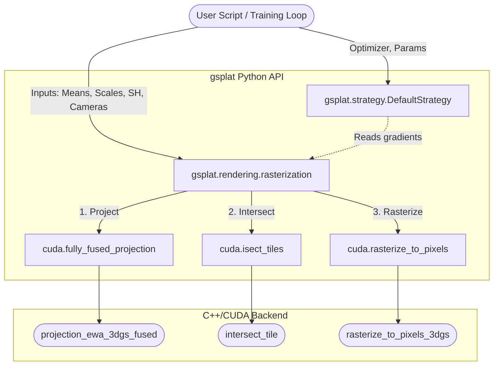
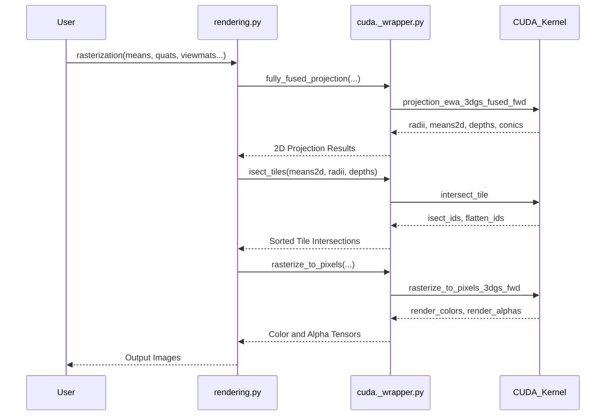

# gsplat Repository Analysis

`gsplat` is an open-source library for CUDA-accelerated rasterization of 3D and 2D Gaussians with Python bindings, originally inspired by the SIGGRAPH paper [3D Gaussian Splatting for Real-Time Rendering of Radiance Fields](https://repo-sam.inria.fr/fungraph/3d-gaussian-splatting/). It provides a flexible and efficient memory architecture, scalable training strategies, and advanced rendering capabilities.

This document serves to explain the core components, key linkages, and important implementations inside the `gsplat` repository.

---

## 1. Core Components

The repository is structured to separate high-level Python rendering and densification logic from low-level CUDA optimization operations. The main foundational components include:

### Rendering Engine (`gsplat/rendering.py`)
This file is the primary entry point for users interacting with the rasterizer.
- [**`rasterization()`**](./gsplat/rendering.py#L108): A comprehensive wrapper function that handles mapping 3D Gaussians (means, opacities, covariances/scales/rotations, and colors/spherical harmonics) to 2D image planes. It supports batched and distributed multi-GPU rendering, spherical harmonics evaluation, and various rendering modes (RGB, Depth, Expected Depth).

### CUDA Backend Wrappers (`gsplat/cuda/_wrapper.py`)
This file serves as the bridge between Python (PyTorch) and the underlying C++/CUDA extension.
- [**`_FullyFusedProjection`**](./gsplat/cuda/_wrapper.py#L1031): A PyTorch `autograd.Function` that projects 3D Gaussians into 2D camera coordinates. It seamlessly fuses covariance calculation, coordinate transformation, and projection into a single CUDA execution to optimize memory and runtime overhead.
- [**`isect_tiles()`**](./gsplat/cuda/_wrapper.py#L444): Determines which 2D tiles a projected Gaussian intersects with. This is heavily optimized using radix sorting algorithms.
- [**`rasterize_to_pixels()`**](./gsplat/cuda/_wrapper.py#L544): The core rasterization method that alpha-blends the Gaussians within each tile to render the final image pixels.

### Densification Strategy (`gsplat/strategy/default.py`)
Training high-quality Gaussian Splats relies on heuristically adding or removing Gaussians.
- [**`DefaultStrategy`**](./gsplat/strategy/default.py#L12): Encapsulates the logic of periodically duplicating Gaussians with small scales, splitting Gaussians with large scales, and pruning transparent ones. By hooking into the PyTorch backward pass, it tracks image-plane gradients.

### CUDA Source (`gsplat/cuda/csrc/`) & C++ Extension (`setup.py`)
- [**`get_extensions()`**](./setup.py#L32): The `setup.py` dynamically builds the PyTorch CUDA extension using `CUDAExtension` linking against the `.cu` and `.cpp` sources.

---

## 2. Key Linkages

The system relies on both static imports and runtime data flow to bridge Python's high-level flexibility with CUDA's performance.

### Static Linkages
1. The user imports `rasterization` from `gsplat`.
2. `rasterization` handles Python-level tasks: formatting inputs, resolving batching, evaluating spherical harmonics, and organizing multi-GPU distributed operations.
3. `rasterization` calls into functions from `gsplat.cuda._wrapper` (e.g., `fully_fused_projection`, `isect_tiles`, `rasterize_to_pixels`).
4. `gsplat.cuda._wrapper` contains `torch.autograd.Function` classes which explicitly call the lazily-loaded `_C` module bindings linked to the C++ and CUDA code.

### Architecture Diagram

---

## 3. Important Implementations

### The Fused Projection & Rasterization Pipeline
The core efficiency of `gsplat` comes from separating rendering into a three-step process tightly integrated with `torch.autograd`.

1. **Fully Fused Projection**: Instead of separately calculating camera transformation, scaling, rotation, and covariance matrices in Python (which uses excess memory), `_FullyFusedProjection` passes the raw 3D inputs directly to CUDA. The CUDA kernel calculates the view-dependent 2D covariances, bounding radii, and depths in one go.
2. **Tile Intersection**: `isect_tiles` assigns Gaussians to 16x16 pixel screen tiles. A fast sorting mechanism groups the Gaussians by tile and depth (front-to-back), forming the fundamental basis for correct alpha blending without race conditions.
3. **Pixel Rasterization**: `rasterize_to_pixels` evaluates the 2D Gaussian equation per pixel. It reads the sorted tile lists and accumulates colors front-to-back until an opacity of 1.0 is reached, saving compute by bypassing hidden splats.

### Sequence Diagram: Forward Rasterization Pass

### Densification Strategy
To accurately model a scene, the network cannot rely on a fixed set of Gaussians. `DefaultStrategy` provides methods hookable to the training loop:
- `step_pre_backward`: Saves PyTorch gradients on the 2D projected means tensor.
- `step_post_backward`: Evaluates accumulated gradients. If a small Gaussian has a high 2D gradient, it is **duplicated** (`duplicate`). If a large Gaussian has a high 2D gradient, it is **split** (`split`). If a Gaussian drops below a minimum opacity threshold, it is **pruned** (`remove`).

### Selective Adam Optimizer
Training scenes with millions of Gaussians results in immense optimization overhead. The repository implements [**`SelectiveAdam`**](./gsplat/optimizers/selective_adam.py#L6), which extends PyTorch's Adam optimizer. It takes a `visibility` mask tensor and only applies the moment-updates and gradient steps to Gaussians that were actively seen/rendered in that step, drastically reducing computation.