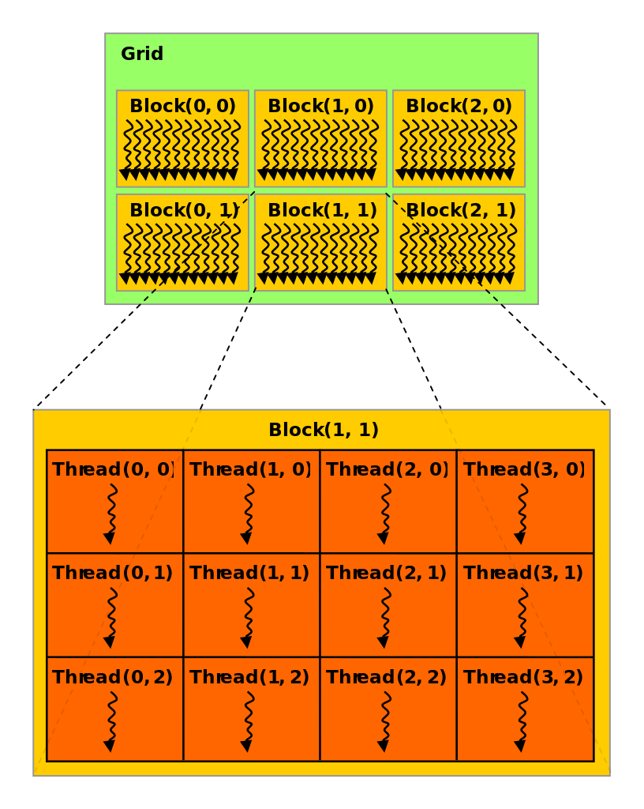

CUDA Conventions
===================================

.. currentmodule:: gsplat

Here we explain some conventions used for the implementation of the CUDA backend.

Kernel Launch Conventions
-------------------------

The backend CUDA code consists of several kernel functions that run in parallel for either arbitrary number of Gaussians or for arbitrary image dimensions.
A kernel function is a function that runs on the device and is executed by a single processing thread.

CUDA organizes individual threads into blocks of dimension ``blockDim``. Multiple thread blocks are grouped into a grid with dimensions ``gridDim``. The dimensions for both can be either 1D, 2D, or 3D.
See illustration below for a two-dimensional grid and block example :cite:p:`thread_block`:

To launch a kernel, and hence process input data in parallel on device, we need to specify the ``blockDim`` and ``gridDim`` for the kernel in advance. A kernel function is launched with the ``kernelFunctionName<<<gridDim, blockDim>>>(inputs*)`` notation. 

A 1D grid and 1D block can be simply launched with ``<<<num_blocks, N_THREADS>>>`` notation. 
``N_THREADS`` denotes the number of individual threads in a single thread block and must be less than or equal to the maximum number of threads for the given CUDA compute compatibility (usually 256 or 1024). 

2D and 3D grids/blocks are launched with ``<<<dim3{gridDim.x, gridDim.y, gridDim.z}, dim3{blockDim.x, blockDim.y, blockDim.z}>>>`` notation. Note that ``blockDim.x * blockDim.y * blockDim.z <= N_THREADS``.

1D Grids
^^^^^^^^

Kernel functions that depend on the number of input Gaussians are organized into a CUDA grid consisting of

.. code-block::

    const int gridDim = (num_gaussian_operations + N_THREADS - 1) / N_THREADS;
    
1D blocks containing ``const int blockDim = N_THREADS;`` threads each. An example of a kernel function that depends on the number of Gaussians (here denoted by the ``num_gaussian_operations`` variable)
is the main `project_gaussians` kernel that projects an arbitrary number of 3D Gaussians into 2D.

2D Grids
^^^^^^^^

Kernel functions that depend on the rendered output image size are organized into 2D CUDA grids. The shape of the grid is determined by 

.. code-block::
    
    const dim3 gridDim = {(img_width + block_width - 1) / block_width, (img_height + block_width - 1) / block_width, 1};

where each individual block within the grid contains a layout of threads defined by ``const dim3 blockDim = {block_width, block_width, 1};``. Note that ``block_width * block_width * 1 <= N_THREADS``.
An example of a kernel function that requires 2D grids is the main `rasterize_Gaussians` kernel that renders an arbitrary number of pixels in an output image.

Config Constants
----------------

We fix the total number of threads within a block to ``N_THREADS = 256``. This is compatible with most CUDA devices. For 1D blocks the block dimension is then given by ``const int blockDim = 256;`` and for 2D blocks we set ``block_width = 16`` by default such that the blockDim is ``const dim3 blockDim = {16, 16, 1};``.

Citations
-------------
.. bibliography::
    :style: unsrt
    :filter: docname in docnames