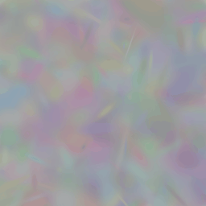

Simple Trainer
===================================

.. currentmodule:: gsplat

Training on an image
-----------------------------------
The `examples/simple_trainer.py` script allows you to test the basic forward projection and rasterization of random gaussians
and their differentiability on a single training image. This allows you to overfit gaussians on a single view.

Simply run the script with:

.. code-block:: bash
    :caption: simple_trainer.py

    python examples/simple_trainer.py --height 256 --width 256 --num_points 2000 --save_imgs

to get a result similar to the one below:

You can also provide a path to your own custom image file using the ``--img_path`` flag:

.. code-block:: bash

    python examples/simple_trainer.py --img_path PATH_TO_IMG --save_imgs
