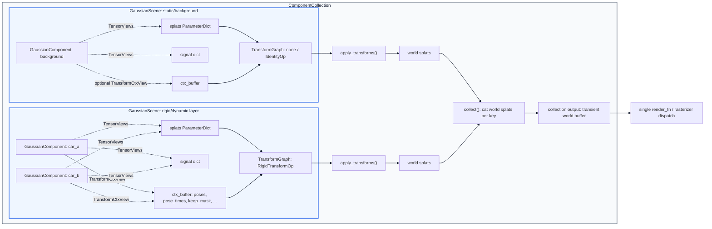
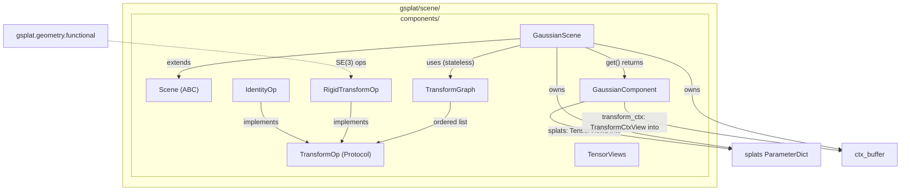
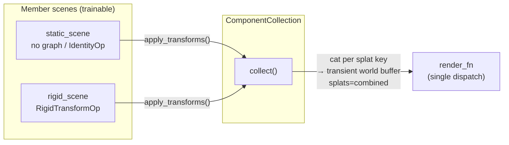
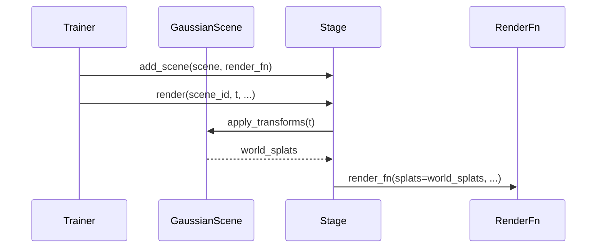
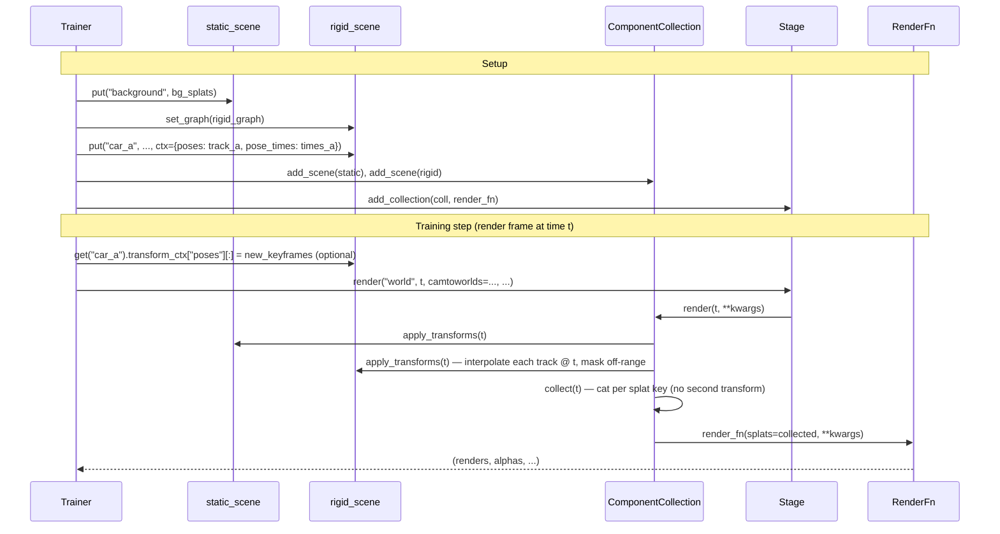

# Scene Components and Transform Pipelines

## 1. High-Level Overview

### 1.0 Proposed Renaming

**Deferred — not part of the first implementation.** A rename of `GaussianScene`
was considered but is explicitly out of scope here: the transform work is
additive and does not change what the class fundamentally is, and the previously
floated `GaussianPackedComponents` collides with established vocabulary — in
`design.md`, "packed" already means the *activated, inference-side* layout
(`GaussianInferenceScene`, `qso_packed`), the opposite of this raw log-space
training scene. The canonical name therefore stays **`GaussianScene`** throughout
this document. If a clearer name is wanted later, it should be a standalone
follow-up (a non-colliding candidate such as `GaussianTrainingScene`) that owns
its own blast radius, not a rider on this feature.

### 1.1 Intent

A `GaussianScene` is the training-side container that owns an arbitrary
*representation* and produces render-ready Gaussians for the rasterizer. It keeps
the existing flat `ParameterDict` collector model, but adds an extensible
`TransformGraph` pipeline between scene storage and rasterization.

At the top level:

1. A scene owns trainable splats, auxiliary signal, per-component bookkeeping,
   and transform context.
2. Components are named partitions into those scene-owned buffers.
3. A stateless graph maps `(representation + ctx)` to world-space, render-ready
   splat tensors.
4. Stage can merge multiple independently transformed scenes into one flat
   rasterizer dispatch.

The end-to-end ownership and data flow is:



The same shape should eventually cover rigid layers, deformable layers,
scaffold/anchor systems, and LoD hierarchies. The first iteration only
implements the rigid path.

### 1.2 Representation Families

The architecture should accommodate these families over time, though not all are
in scope for the first iteration:

| Kind | Representation (examples) | Context (examples) |
|------|-------------------------|-------------------|
| Rigid layer | Local means/quats + per-component SE(3) pose tracks (keyframes) | Render timestamp `t` → interpolated per-component pose |
| Deformable layer | Rigid + deformation net offsets | Same as rigid |
| Track scale / albedo | Rigid/deformable + per-track learnable scale or 3×4 albedo | Same as rigid |
| Scaffold-GS-like | Anchor points + spawn parameters | Anchor indices, spawn rules |
| LoD-like | Multi-level Gaussian hierarchy | Level selection / blend weights |

> **Note on per-component *trainable* state.** The v1 storage model has three
> buckets: `splats` (per-Gaussian, trainable), `signal` (per-Gaussian,
> non-rasterized), and `ctx_buffer` (per-component, **non-trainable** plain
> tensors). The "Track scale / albedo" family needs a *per-component, trainable*
> quantity (a learnable scale / 3×4 albedo per track), which fits **none** of
> these as written. Supporting it is future work: it requires either a trainable
> per-component parameter store or making selected `ctx_buffer` keys trainable
> `nn.Parameter`s wired into an optimizer (and into the topology/strategy handling
> if they ever become per-Gaussian). v1 keeps `ctx_buffer` strictly non-trainable.

### 1.3 First Iteration

Implement the shared plumbing (`ctx_buffer`, `TransformGraph`, `TensorViews`,
`GaussianComponent`, Stage gather) with **`RigidTransformOp`** as the first
concrete op:

- Gaussians are stored in local component frames.
- Each component carries an SE(3) **pose track** (keyframe poses + `pose_times`)
  in the scene's `ctx_buffer`; a static object is the `N_c = 1` case.
- `apply_transforms(t)` interpolates each track to the render timestamp `t` and
  produces transient world-space splats; off-range components are density-masked.
- Dynamic objects get independent trajectories while the scene keeps one flat
  concatenated buffer for single-pass transform and rasterization.

Later **row-preserving** ops — deformation, per-track scale/albedo — plug into the
same `TransformOp` protocol (`apply(collected) -> dict`) without changing the
storage model, since they keep the rows-in == rows-out invariant. **Scaffold spawn
and LoD do not fit the v1 protocol as-is:** they emit a variable number of rows
per render, which breaks the fixed-`M_total` / rows-in == rows-out contract the
protocol and density masking depend on, so they are a **known extension axis that
requires a follow-up protocol change** (variable-size output, gradient flow into a
selection mask, topology semantics), not a drop-in op. See §4.2.3 for the deferred
LoD/scaffold extension paths.

### 1.4 Document Structure

- **Section 2** describes the design goals, constraints, and architecture.
- **Section 3** specifies interfaces, method contracts, data flow, and Stage
  integration details.
- **Section 4** records decisions, resolved questions, future work, and
  dependencies.

## 2. Design Goals and Architecture

### 2.1 Functional Requirements

- Must extend `GaussianScene` to own a stateless `TransformGraph` and a
  `ctx_buffer` that together define how the scene's representation is mapped to
  render-ready Gaussians (rigid local→world in v1; other ops later)
- Must allow each named component in a scene to optionally carry per-component
  transform context (stored in the scene's `ctx_buffer`)
- Must provide a stateless `TransformGraph` that, given collected splats + ctx,
  applies a sequence of `TransformOp` nodes and returns world-space results
- Must provide `TensorViews` so that each component gets a typed view into both
  the scene's splats buffer and the scene's ctx_buffer
- Must provide a `RigidTransformOp` that applies SE(3) pose transforms using the
  existing `gsplat.geometry.functional` operations (differentiable)
- Must support **time-varying** rigid motion: each component carries a pose track
  (keyframe poses + `pose_times`), and a render-time timestamp `t` selects the
  interpolated per-component pose (differentiable lerp + SLERP); single static
  poses are the `N_c = 1` degenerate case
- Must density-mask components whose pose-track time span does not cover `t`
  (off-range → zero density), preserving the fixed-`M_total` (rows-in == rows-out)
  model
- Must provide an `IdentityOp` for components that require no transformation
- Must treat a scene as **homogeneous in transform type**: every component in a
  scene is transformed by the same graph, so a scene with a `RigidTransformOp`
  graph requires **every** component to carry valid rigid ctx (a pose track,
  `N_c = 1` for static). A background/static scene uses a no-op graph
  (`None` / `IdentityOp`) and an **empty** `ctx_buffer`. This homogeneity is
  **validated at `put()` time** (see §3.8.2) — mixed ctx / no-ctx components
  under a non-identity graph are rejected.
- Must provide a `ComponentCollection` that owns multiple `GaussianScene` members,
  runs `collect()` to merge their world-space splats into one buffer, and drives
  a **single** shared `render_fn` dispatch (see §3.9)
- Must integrate with `Stage` so rasterization sees one concatenated world-space
  buffer per collection, preserving the flat-buffer single-pass model
- Must transform all components in a scene **vectorized over the whole scene
  buffer** (no per-component Python loop / no per-component kernel launch). v1
  ships the **composed path**: a vectorized `se3_interpolate_tracks` geometry
  helper producing `pose_t [C, 3]` and `pose_q [C, 4]`, then a
  `pose_at_t[component_index]` fan-out and the SE(3) `se3pose_transform_point` +
  `quat_multiply` over all `M_total` Gaussians at once. This keeps the scene code
  composed while relying on the fused geometry helper for the ragged track
  interpolation.
  - **Backward scope (v1):** poses are fixed buffers (§2.2), so gradients flow to
    `means` and local `quats` **only** — autograd handles this automatically for
    the composed path (no hand-written backward).
  - **Single end-to-end fused dispatch is a FUTURE perf milestone, not a v1
    gate** (decision reversed from the earlier review — see §4.2.1 #10). Fusing
    the per-component interpolation + fan-out + transform into one
    `M_total`-domain CUDA kernel (with a hand-written means/quats backward) is a
    measured optimization layered on later; it is gated against the composed path
    as correctness oracle (`gradcheck`) and performance baseline.
  `se3pose_transform_point` ("transform point"), `quat_multiply`, and
  `quat_slerp` already exist in `gsplat.geometry.functional`; the v1
  `se3_interpolate_tracks` is a new geometry helper with Python wrapper
  validation and fused CUDA execution (see §3.6, §3.6.1, §4.3).

### 2.2 Non-Functional Requirements

- Transform application must be differentiable — gradients flow back through
  SE(3) operations to the Gaussian parameters (local means, quats). **v1 scope:**
  keyframe `poses` / `pose_times` are **fixed, non-trainable buffers** (plain
  tensors, not `nn.Parameter`); they are not added to any optimizer (so there is
  no *optimizer-state* checkpoint story). Differentiating *into* the pose
  track for trajectory calibration is a **future** capability — the
  interpolation is built to be differentiable so it can be enabled later, but v1
  does not optimize poses.
- **`ctx_buffer` is part of the persisted state.** Being non-trainable does not
  mean transient: `poses` / `pose_times` / `keep_mask` (and the per-component
  ctx-range metadata that maps them back to components) define the scene's motion
  and must round-trip through `state_dict()` / `from_state_dict()` alongside
  splats / signal / `component_index`. A scene loaded without its `ctx_buffer`
  cannot rebuild a valid rigid graph. See §3.8.4 for the serialization contract.
- Must not require changes to the rasterizer — transforms produce world-space
  means/quats that the existing rasterizer consumes
- Must preserve the existing `GaussianScene` storage model (flat concatenated
  `ParameterDict` + `component_index`)
- Transform registration must be init-time only (like `put()`), not per-step

### 2.3 Verification Requirements

> **GPU-gated (S3).** The transform / gradient / golden tests below exercise the
> CUDA geometry primitives (§3.6.1), so they are **skipped when CUDA is
> unavailable** and CI must run them on a GPU runner. This is a deliberate
> GPU-path focus; there is no CPU math fallback.

> **Scope of GPU gating.** Only tests that exercise the CUDA geometry primitives
> (`se3pose_transform_point`, `quat_multiply`, `quat_slerp`,
> `se3_interpolate_tracks`) require a GPU runner. Tests that exercise only the
> Python/storage layer — `put()` validation errors, homogeneity gates,
> serialization round-trips, legacy checkpoint load, `TransformCtxView` lazy
> resolution, and `add_scene` schema rejection — run on CPU and **must not** be
> GPU-gated. Keep these as two separate pytest marks (`gpu_required` vs. the
> default CPU suite) so a CPU-only developer can still verify the storage and
> validation infrastructure.

- **Autograd / optimizer stability:** After `apply_transforms(t)`, compute a scalar
  loss on `world_splats["means"]` and call `backward()`. Assert gradients reach
  `scene.splats["means"]`; assert `.grad.isfinite().all()` and
  `grad.abs().max() > 0` (non-zero gradient, not just non-None), and that
  `id(scene.splats["means"])` is
  unchanged across repeated renders (no `nn.Parameter(transformed)` replacement on
  `scene.splats`). (v1: poses are fixed buffers, so no gradient-to-pose assertion
  is required; the track interpolation is still built differentiable so a future
  calibration test can assert gradients reach the keyframe `poses`.)
- **Time interpolation:** For a 2-keyframe track at times `[t0, t1]`, assert
  `apply_transforms(t0)` / `apply_transforms(t1)` reproduce the endpoint poses and
  a midpoint `t` produces the lerp/SLERP-interpolated pose (use
  `torch.allclose` with `atol=1e-5`, feeding unit quaternions — see §3.6
  normalization caveat); assert an `N_c = 1`
  track is time-independent. Assert a component is density-masked
  (opacity logit → `HIDDEN_OPACITY_LOGIT`, a finite large-negative sentinel so
  `sigmoid → 0`) when `t` falls outside its keyframe span, and assert the masked
  forward/backward stay finite (no `-inf`/NaN).
- **Multi-keyframe interpolation (N_c ≥ 3):** Build a component with a
  4-keyframe track (times `[t0, t1, t2, t3]`). Assert that querying
  `apply_transforms(t)` for `t` in the middle segment `[t1, t2]` produces the
  SLERP-interpolated pose between keyframes 1 and 2 (not keyframes 0/3). Assert
  that `t` exactly at `t1` reproduces keyframe 1's pose. This is the primary
  test of the `searchsorted` bracket selection in `se3_interpolate_tracks`.
- **Quaternion convention + composition golden test (§3.6):** Build a known
  rigid SE(3) pose `(t_vec, R)`, transform a small set of local means/quats
  through `RigidTransformOp.apply()`, and assert world means/quats match an
  independent reference (compose the homogeneous matrices from
  `se3pose_to_matrix(pose_t, pose_q_xyzw)` with the splat rotation converted to
  a matrix). Feed unit quaternions on both sides (see normalization caveat in
  §3.6). This catches a flipped composition order (`R_local ∘ R_pose`) and a
  missing xyzw↔wxyz conversion. Also test near-parallel and antipodal quaternion
  pairs as specified in §3.6.1.
- **Visibility boundary (§3.9.4):** For a 2-keyframe component with span
  `[t_first, t_last]`, assert that `apply_transforms(t_first)` and
  `apply_transforms(t_last)` produce **non-masked** outputs (inclusive
  boundary), and that `t_first - ε` and `t_last + ε` (for `ε = 1e-5`) produce
  density-masked (opacity `HIDDEN_OPACITY_LOGIT`) outputs. This pins the
  inclusive-boundary convention.
- **`_collect_gaussians`:** Must expose live `Parameter` tensors, not `.data` /
  `.detach()`, so the graph is not cut before ops run.
- **`transform_ctx` after `put()`:** Register component A, then `put()` component
  B growing `ctx_buffer["poses"]`; write through `A.transform_ctx["poses"]` and
  assert `apply_transforms()` sees the update (lazy `TransformCtxView` resolution).
- **Component views stay valid across `put()` and densification:** Register
  component A, `put()` component B (growing `splats`/`signal`), then run a
  densification op (split/duplicate) on the scene. Assert `A.splats["means"]`
  still selects A's rows and is visible to `apply_transforms()`. This exercises
  both the identity-stable `splats`/`signal` dicts (§3.8.2) and the
  per-component row selection that falls back to `component_index` when topology
  scatters rows (§3.3, §3.8).
- **Pass-through aliasing contract (B8):** Assert no transform op mutates
  `collected` tensors in place. Untransformed keys may be live splat tensors to
  preserve the existing render path; render functions must treat `splats` as
  read-only inputs.
- **`ctx_buffer` serialization round-trip (§3.8.4):** Build a rigid scene with a
  multi-keyframe track + a `keep_mask`, `state_dict()` → `from_state_dict()`, and
  assert `poses` / `pose_times` / `keep_mask` and the per-component `ctx_ranges`
  match (so `apply_transforms(t)` renders identically), and that the B6 invariant
  re-assertion rejects a hand-corrupted checkpoint (`pose_times` rows ≠ `poses`).
- **Legacy checkpoint load (§3.8.4):** `from_state_dict()` on an **old** checkpoint
  with no `ctx_buffer` / `ctx_ranges` keys loads as a static scene (empty
  `ctx_buffer`, no graph) without error.
- **Homogeneity / ordering gates (§3.8.1–3.8.2):** assert `put()` with `ctx=`
  under a `None` graph **raises**; a `RigidTransformOp` scene rejects a ctx-less
  `put()`; and a late `set_graph(rigid)` over an already-registered ctx-less
  component **raises** (re-validation).
- **`add_scene` schema rejection (§3.9.2):** assert `add_scene` raises on a member
  with a missing/extra splat key, a mismatched `sh` trailing dim (SH-degree
  mismatch), or a different dtype/device; and on an empty member.
- **Interpolation edge cases (§3.6.1):** in addition to the 2-keyframe
  endpoint/midpoint test, assert a `t` past both ends clamps to the endpoint pose
  (no extrapolation) and that a duplicate / zero-length segment
  (`pose_times = [t, t]`) resolves deterministically (no NaN) — pinning the
  defined-but-discontinuous behavior so it can't silently change.
- **Per-member densification routing (`split_info`, §3.9.5):** build a 2-member
  collection (member A, member B) with known per-member row counts, render once,
  `backward()`, and assert `split_info(info)` yields per-member slices such that
  (a) member A's `grad2d` / `count` updates match running each member's strategy on
  an A-only render of the same scene (no cross-member leakage / double-count), and
  (b) `gaussian_ids` are rebased into each member's local `[0, M_member)` range.
  Run for **both packed and unpacked** modes.
- **Masked rows excluded from stats (§3.9.5 note 4):** with a rigid member whose
  component is off-range at `t` (density-masked), assert those rows have
  `radii == 0` in `info` and contribute **zero** to the member's `grad2d` / `count`
  (i.e. the `radii > 0` filter drops them) and produce no NaN.
- **`keep_mask` behavior (§3.8.2):** (a) Register component A without
  `keep_mask`, then register component B with `keep_mask=False`; assert
  `ctx_buffer["keep_mask"]` is `[True, False]` (lazy backfill of `True` for A).
  (b) For component B inside its time range but with `keep_mask=False`, assert
  its rows are density-masked. (c) For a `None`-graph scene that uses
  `IdentityOp` + `keep_mask=False`, assert the component is masked (the "no
  transform but maskable" path, §3.8.1).
- **Multi-member gradient flow:** Build a 2-member `ComponentCollection` (one
  static, one rigid), call `collect()` to obtain world splats, compute a scalar
  loss on `world_splats["means"]`, call `backward()`, and assert that both
  `static_scene.splats["means"].grad` and `rigid_scene.splats["means"].grad` are
  non-`None` and `isfinite().all()`. This verifies the `torch.cat` in
  `collect()` does not cut the autograd graph for either member.

### 2.4 High-Level Architecture



The **scene** is the parent container that owns the full representation path:
trainable **splats** (renderable Gaussian parameters), **signal** (per-Gaussian
auxiliary features; see `GaussianComponent` below), **ctx_buffer** (opaque
context for transform ops: per-component pose tracks + keyframe times, visibility
masks, future deform embeddings), and **components** (named partitions into the
flat buffers). It
collects splats + ctx and passes them through the **TransformGraph**, a stateless
sequence of `TransformOp`s, to produce render-ready Gaussians. Local→world rigid
motion is only the first such op; the scene role is intentionally broader than
SE(3).

The diagram above shows only the `gsplat/scene/` components. The multi-scene
**`ComponentCollection`** that merges several scenes into one rasterizer dispatch
(§2.1, §3.9) deliberately lives in **`gsplat/stage/`** (orchestration), not
`gsplat/scene/`, so it is not in this `gsplat/scene` picture — see the §3.9.2 diagram
for the collection-level view.

### 2.5 Ownership Boundaries

- **Scene** owns all data: splats (ParameterDict), signal, component_index,
  ctx_buffer, and components. It also owns `_collect_gaussians()` which
  assembles contiguous data for the graph.
- **TransformGraph** is stateless — just a list of ops. Given collected data,
  it applies transformations and returns results. No references to components,
  no buffers, no state.
- **GaussianComponent** is a view handle: `TensorViews` into the scene's splats
  and signal buffers, plus a `TransformCtxView` (`transform_ctx`) into the scene's
  `ctx_buffer` for this component's `(offset, count)` ranges (`None` when the
  component has no ctx). It owns no data — every read/write resolves live against
  the scene's buffers.
- **Per-component ctx bookkeeping** (`_component_ctx`, `_component_count`,
  `ctx_ranges`) is **scene-owned**, recorded at `put()` and serialized (§3.8.1,
  §3.8.4); `TransformCtxView` and the CSR `_ctx_offsets`/`_ctx_counts` read it.

## 3. Interfaces and Implementation Details

### 3.1 `GaussianScene` State

`GaussianComponent` and `TransformGraph` hang off a `GaussianScene` instance.
The scene's owned fields (existing today + additions in this design) are:

| Member | Type | Role |
|--------|------|------|
| `id` | `str` | Unique scene identifier (Stage registry key). |
| `splats` | `nn.ParameterDict` | Trainable, renderable Gaussian parameters (`means`, `quats`, `scales`, `opacities`, `sh*` / colors, …). One flat `[M_total, …]` buffer across all `put()` components; optimizer state attaches here. |
| `signal` | `dict[str, Tensor]` | Per-Gaussian auxiliary tensors aligned row-for-row with `splats` (features, albedo corrections, etc.) — **not** consumed directly by the rasterizer. |
| `component_names` | `list[str]` | Registration order of named components (`put("car_a", …)` → append). |
| `component_index` | `Tensor [M_total]` | `component_index[i]` → index into `component_names` (exclusive ownership per row). |
| `ctx_buffer` | `dict[str, Tensor]` | **New.** Transform context from `put(..., ctx=…)`. v1 rigid keys are **per-component pose tracks** — `poses` `[ΣN_c, 7]` and `pose_times` `[ΣN_c]` packed CSR-style (`N_c` keyframe rows per `put()`), not per-Gaussian. Disjoint from `splats` key names. |
| `_graph` | `TransformGraph \| None` | **New.** Stateless op pipeline set via `set_graph()`; `None` when the scene needs no transforms (background-only). |

At render time the scene calls `_collect_gaussians()` (splats + `ctx_buffer` → one
dict), runs `_graph.apply()` if set, optionally applies density masking, and
returns a transient world-space splats dict via `apply_transforms()` without
replacing `self.splats`. See `gsplat/scene/design.md` for the baseline `put()` /
topology contract on the existing fields.

**Component-index invariant.** `splats`, `signal`, and `component_index` stay
row-aligned: every Gaussian row has exactly one component id, and topology hooks
update `component_index` / `signal` whenever strategy ops add, remove, split, or
relocate rows. `put()` appends new components contiguously, but later
densification can scatter a component's rows. `TensorViews` (§3.3) therefore use
a contiguous slice when available and fall back to live component indices when
the rows are scattered. The `splats` and `signal` containers also keep a **stable
object identity** for the life of the scene — `put()` and densification mutate
their entries in place rather than rebinding the dict — so a held `TensorViews`
reference always reads current tensors.

### 3.2 `GaussianComponent`

A view handle into the scene's buffers for a single named component.

```python
@dataclass
class GaussianComponent:
    id: int                                  # component id within the scene
    splats: TensorViews                      # live view into scene's splats buffer
    signal: TensorViews                      # live view into scene's signal buffer
    # Per-key (offset, count) ranges into scene's ctx_buffer. Resolved on
    # every access via `scene.ctx_buffer[key][offset:offset+count]` so the
    # view stays valid even after a later put() reallocates ctx_buffer[key]
    # (e.g. via torch.cat). The component exposes `transform_ctx` as a
    # dict-like accessor that performs this lookup; it never caches slice
    # tensors. None when the component has no transform context.
    transform_ctx: TransformCtxView | None
```

`TransformCtxView` is a thin wrapper holding a reference to `scene.ctx_buffer`
plus the `{key: (offset, count)}` map for this component. Both reads
(`view["poses"]`) and in-place writes (`view["poses"] = ...` or
`view["poses"][:] = ...`) re-resolve the slice against the current
`ctx_buffer[key]`, so any later `put()` that grows a shared key (rebinding
`ctx_buffer[key]` to a new `torch.cat` result) is transparent — views never go
stale.

The `signal` buffer holds per-Gaussian auxiliary feature data — values tracked
alongside each Gaussian that are not themselves renderable splat keys (means,
quats, scales, opacities, sh*). Like `splats`, it is a flat scene-owned
`dict[str, Tensor]` whose entries share the same per-Gaussian leading dimension
(total Gaussian count across all components); each entry's trailing dimensions
are key-specific (e.g. an `[M_total, 3]` per-Gaussian RGB albedo correction, an
`[M_total, F]` per-Gaussian learned feature vector). Because its row layout
matches `splats`, the same `(offset, count)` pair slices both per-component, so
`TensorViews` is used for both.

Why `splats` / `signal` use `TensorViews` but `transform_ctx` uses
per-key ranges: every splat key shares the same per-Gaussian row layout, so one
`(offset, count)` pair slices all splat keys via `TensorViews`. `transform_ctx`
uses per-key `(offset, count)` because ctx keys can differ in shape — and in
**v1 rigid transforms**, ctx is **per-component** (and per-keyframe within a
component), not per-Gaussian. Here `count` is the component's keyframe count
`N_c`, so the same range slices both `poses` `(N_c, 7)` and `pose_times` `(N_c,)`.

**v1 rigid rule:** one SE(3) **pose track per component** — `N_c` keyframe poses
+ keyframe times — collapsed to a single pose at the render timestamp `t`, then
shared by all `M` Gaussians in the component. At `put("car_a", …,
ctx={"poses": tensor(N, 7), "pose_times": tensor(N,)})`, the scene appends `N`
rows to `ctx_buffer["poses"]` (and `pose_times`), giving a packed `[ΣN_c, 7]`
buffer across the scene with per-component `(offset, N_c)` ranges. `pose_times` is
required for **every** component (gated at `put()`), so `poses` and `pose_times`
always grow by the same `N_c` rows and one `(offset, N_c)` range slices both. A
single static pose is the degenerate `N_c = 1` case:
`ctx={"poses": tensor(7,), "pose_times": tensor(1,)}` appends one row to each and is
always-on (the lone time value is unused). `component_index` (already maintained by the
scene) maps each Gaussian row to its component id; `RigidTransformOp` interpolates
each component's track at `t` to `pose_t [C, 3]` and `pose_q [C, 4]`, then does
`pose_at_t[component_index]` before applying the geometry point/quaternion
helpers. No `gaussian_entity_ids`
buffer and no extra topology-hook work for *ctx* on duplicate/split: ctx is
per-component, so densification never touches `ctx_buffer` — it only updates
`component_index`, and new Gaussians inherit the parent's component id → same pose
track automatically.

The per-Gaussian `splats` / `signal` views are kept valid across densification by
a different mechanism: topology hooks update `component_index` and `signal` in
lockstep with the splat rows. The two paths are asymmetric: ctx ranges are
per-component and stable because densification leaves `ctx_buffer` alone;
splat/signal rows are per-Gaussian and move, so the view resolves its live row
selection from the scene (§3.3).

`TransformCtxView` resolves `transform_ctx["poses"]` lazily against live
`ctx_buffer` (the component's `(offset, N_c)` slice). See the "Storage contract"
note in `put()`.

For components with no transform (e.g., background with `IdentityOp`),
`transform_ctx` is `None`.

#### 3.2.1 Scope: What Is a `GaussianComponent`?

A **component** is one named registration from `put(name, ...)` — a logical
partition of the scene's flat buffers, **not** the whole scene and **not**
necessarily one render layer.

| Concept | Typical mapping |
|---------|-----------------|
| **Render layer** (rigid / deformable / background) | Often **one `GaussianScene`** with its own graph, strategy, and optimizer |
| **Object** or **track group** within a layer | Often **one `GaussianComponent`** (`put("car_a", ...)`, `put("car_b", ...)`) |
| Layer-wide batched work (e.g. track culling before per-Gaussian ops) | **Scene-level** — runs on the full flat buffer or per-entity ctx *before* or *outside* per-component views |

All components in a scene share one concatenated `splats` / `signal` / relevant
`ctx_buffer` rows so transforms and rasterization stay single-pass. Ops like
`RigidTransformOp` dispatch over the **entire scene buffer** in one kernel; the
component abstraction is for registration, ctx validation, and trainer-facing
views — not for forcing per-object kernel launches. When track-based culling
must see all tracks in a layer together, that logic belongs in scene-level or
graph-level code (or a dedicated op), not in isolated per-component slices.

### 3.3 `TensorViews`

A Python-side typed view container inspired by the `TensorView<T, SHAPE...>`
pattern used in the repo's CUDA layer (`gsplat/cuda/csrc/TensorView.h`). Rather
than returning bare `dict[str, Tensor]` where view semantics are implicit,
`TensorViews` makes the component-row selection explicit: when rows are
contiguous it returns a zero-copy slice, and when strategy topology has scattered
the rows it returns an indexed tensor selected by `component_index`.

Both the parent buffer and the row selection are resolved **live** on every access,
which is what keeps the view valid across `put()` and densification:

- **Live parent.** `_parent` is the scene's `splats` / `signal` dict. The scene
  keeps that dict's object identity stable for its lifetime — `put()` and
  densification mutate its entries in place (`dict[key] = cat(...)` /
  `dict[key] = dict[key][perm]`) rather than rebinding the dict — so a held
  reference always reads the current tensors.
- **Live range / indices.** `(offset, count)` is **not** frozen at construction;
  it is read from `range_fn()` on every access when rows are contiguous. If the
  component rows are scattered, `range_fn()` returns `None` and `indices_fn()`
  supplies the live row indices derived from `component_index`.

```python
class TensorViews:
    """Named collection of component tensor selections into a flat buffer.

    Contiguous selections share storage with the parent tensor. Scattered
    selections use index gather and should be treated as read/gradient access,
    not an in-place mutation surface.

    Parent identity and row selection are both resolved live (see above), so the
    view never goes stale on a later `put()` or topology change.
    """

    def __init__(
        self,
        parent: dict[str, Tensor],            # live splats/signal dict (identity-stable)
        range_fn: Callable[[], tuple[int, int]],  # -> this component's live (offset, count)
    ) -> None:
        self._parent = parent
        self._range_fn = range_fn

    @property
    def offset(self) -> int:
        return self._range_fn()[0]

    @property
    def count(self) -> int:
        return self._range_fn()[1]

    def __getitem__(self, key: str) -> Tensor:
        """Return a slice view: parent[key][offset:offset+count]."""
        offset, count = self._range_fn()
        return self._parent[key][offset : offset + count]

    def __contains__(self, key: str) -> bool:
        return key in self._parent

    def keys(self) -> KeysView[str]:
        return self._parent.keys()

    def items(self) -> Iterator[tuple[str, Tensor]]:
        for k in self._parent:
            yield k, self[k]

    def mergeable(self, other: "TensorViews") -> bool:
        """True if self and other are *currently* adjacent slices of the same parent.

        Resolved against the live ranges. Only meaningful for the same
        splat/signal parent — e.g. checking that component A's and component B's
        views over `splats` are adjacent — and only within a single step, since
        the next densification may move boundaries. (Ctx uses `TransformCtxView`
        per-key ranges instead.)
        """
        if self._parent is not other._parent:
            return False
        o_self, c_self = self._range_fn()
        o_other, _ = other._range_fn()
        return o_self + c_self == o_other

    def merge(self, other: "TensorViews") -> "TensorViews":
        """Merge two currently-adjacent views into one wider transient view.

        Requires self.mergeable(other). The result is a zero-copy view over the
        combined span, pinned to the ranges resolved now — valid for immediate
        (same-step) use, before any further topology change.
        """
        if not self.mergeable(other):
            raise ValueError("Cannot merge non-adjacent views")
        o_self, c_self = self._range_fn()
        _, c_other = other._range_fn()
        start, total = o_self, c_self + c_other
        return TensorViews(self._parent, lambda: (start, total))
```

When a component occupies a contiguous row range `[offset, offset + count)`,
slicing with `tensor[offset:offset+count]` produces true tensor views (shared
storage, no copy). If densification scatters a component's rows, `TensorViews`
falls back to live row indices. The selection is resolved per access, so the same
view object keeps selecting the component's correct rows after the buffer grows
(`put()`) or strategy ops mutate topology.

Two `TensorViews` over the same parent whose live ranges are adjacent can be
merged into a single wider view via `merge()` — still zero-copy, just a wider
slice, valid until the next topology change. **`merge` / `mergeable` are
forward-looking** — no v1 code path calls them (the v1 transform/collect flow
operates on the full scene buffer, not on merged component views). They are
included as part of the `TensorViews` contract for future multi-component batched
work; treat them as optional, not a v1 requirement.

The `TensorViews` abstraction also serves as a natural bridge to the C++ kernel
layer: when dispatching to CUDA, the `offset` and `count` fields provide exactly
the information needed to construct a `TensorView<T, N, D>` over the parent
tensor's data pointer without any Python-side copy or reallocation.

### 3.3.1 `TransformCtxView`

A component-scoped, dict-like view into the scene's `ctx_buffer`. Each key in `ctx_buffer` is a flat buffer covering all components (e.g. `poses [ΣN_c, 7]`, `pose_times [ΣN_c]`); `TransformCtxView` exposes only the slice for one component.

```python
class TransformCtxView:
    """Dict-like view into a scene's ctx_buffer for a single component.

    Wraps `ctx_buffer` (the scene's flat context tensors) with a per-key
    `(offset, count)` range map recorded at `put()` time. Every read/write
    routes through `ctx_buffer[key][offset:offset+count]`, so the view is
    always live against the scene's current buffer — no caching.
    """

    def __init__(
        self,
        ctx_buffer: dict[str, Tensor],
        ranges: dict[str, tuple[int, int]],  # {key: (offset, count)}
    ) -> None:
        self._buf = ctx_buffer
        self._ranges = ranges

    def __getitem__(self, key: str) -> Tensor:
        """Return the component's slice of ctx_buffer[key]. Zero-copy view."""
        offset, count = self._ranges[key]
        return self._buf[key][offset : offset + count]

    def __setitem__(self, key: str, value: Tensor) -> None:
        """Write into the component's slice of ctx_buffer[key] in place.

        `value` must have the same shape, dtype, and device as the component's
        slice. Used for host-side updates (e.g. loading new keyframes); in v1
        poses are fixed, non-trainable buffers (§2.2), so this write path is
        NOT gradient-driven.
        """
        offset, count = self._ranges[key]
        self._buf[key][offset : offset + count] = value

    def keys(self) -> KeysView[str]:
        """Return the ctx keys this component owns (component-scoped, not scene-wide)."""
        return self._ranges.keys()

    def __contains__(self, key: object) -> bool:
        return key in self._ranges

    def get(self, key: str, default: Tensor | None = None) -> Tensor | None:
        if key not in self._ranges:
            return default
        return self[key]
```

Key invariants:
- `keys()` returns **component-scoped** keys (only those registered for this component at `put()` time), not all keys in `ctx_buffer`.
- `__setitem__` writes in-place into `ctx_buffer` — the scene's buffer is mutated, not replaced.
- `__getitem__` produces a true tensor view (shared storage, zero-copy), so writes through the view are immediately visible to `apply_transforms()`.
- `TransformCtxView` is `None` for components that registered no ctx (background / `IdentityOp` path). Check `component.transform_ctx is not None` before accessing.

### 3.4 `TransformGraph`

A **stateless** pipeline of transformation operations. It holds no data, no
buffers, no component references — just a list of ops to apply.

The scene calls `graph.apply(collected)` passing in a pre-assembled dict of
contiguous tensors. The graph applies its ops and returns results.

```python
class TransformGraph:
    """Stateless transformation pipeline.

    Just a sequence of TransformOps. Given collected data (splats + ctx
    merged into a single dict), applies ops in order and returns
    transformed means/quats. Holds no state beyond the op list.
    """

    def __init__(self, ops: list[TransformOp]) -> None:
        self.ops = ops

    def validate_ctx(self, ctx: dict[str, Tensor], count: int) -> None:
        """Validate context against all ops. Called by scene at registration."""
        for op in self.ops:
            op.validate_ctx(ctx, count)

    def apply(self, collected: dict[str, Tensor]) -> dict[str, Tensor]:
        """Apply all ops to the collected data.

        Args:
            collected: merged dict of splats + ctx tensors (contiguous,
                       assembled by the scene's _collect_gaussians()).

        Returns the modified splats dict (world-space). Ops may transform
        any splat key — means, quats, SH coefficients, etc.
        """
        for op in self.ops:
            collected = op.apply(collected)
        return collected
```

The graph is deliberately minimal — no state, no ownership, no lifecycle
management. It's a reusable transform definition that multiple scenes could
even share if they have the same op pipeline.

For the common single-rigid case, `ops` contains exactly one `RigidTransformOp`.
Future fused multi-hop ops can replace a chain of rigid ops with a single
pre-composed transform.

### 3.5 `TransformOp` Protocol

Minimal interface for a single transformation step. Each op is responsible for
validating that the context contains what it needs — the graph/scene layer
treats context as opaque.

```python
class TransformOp(Protocol):
    def validate_ctx(self, ctx: dict[str, Tensor], count: int) -> None:
        """Raise ValueError/KeyError early if ctx is missing required fields
        or has incompatible shapes. Called when a component registers (`put()`).

        `count` is the **number of Gaussians in the registering component**
        (`component["means"].shape[0]`). Its purpose (pinned, S7): it is the
        row-alignment cross-check for ops whose ctx is **per-Gaussian** — a
        future `DeformableOp` validates `ctx["warp_offsets"].shape[0] == count`.
        The two v1 ops legitimately **ignore** `count`: `IdentityOp` has no ctx,
        and `RigidTransformOp`'s ctx is **per-component / per-keyframe** (`N_c`
        pose rows), which is unrelated to the Gaussian count — its alignment
        check is `poses` vs `pose_times` (B6), not vs `count`. `count` is kept in
        the protocol signature so per-Gaussian ops have it without a signature
        change; it is "reserved, not dead."
        """
        ...

    def apply(self, collected: dict[str, Tensor]) -> dict[str, Tensor]:
        """Apply this transformation and return a (possibly new) dict of tensors.

        **MUST NOT mutate `collected` tensors in place.** The dict may contain
        live `nn.Parameter` tensors from `scene.splats` (passed through by
        `_collect_gaussians()`), so in-place mutation (e.g. `tensor.mul_(x)`)
        corrupts the scene's trainable parameters. Always produce new tensors for
        any key you transform:

            # Correct — new tensor, autograd-tracked:
            collected["means"] = se3pose_transform_point(...)
            # Wrong — corrupts scene.splats["means"] if it's a live Parameter:
            collected["means"].add_(delta)

        Ops that do not touch a key may leave it in `collected` unchanged.
        Returning a modified copy of `collected` (with updated keys) is the
        standard pattern.

        `collected` contains both Gaussian data (means, quats, sh, scales,
        opacities, etc.), context tensors, and `component_index` from
        `_collect_gaussians()`. Ops read context keys and modify whichever splat
        keys they need.

        Future ops may transform SH coefficients, scales, or any other splat
        key — not just means/quats.
        """
        ...
```

### 3.6 `RigidTransformOp`

The workhorse transform for v1. A rigid object is **dynamic over time**, so each
component carries a **pose track**: `N_c` keyframe SE(3) poses plus their keyframe
timestamps. At render time the scene supplies a timestamp `t`; the op interpolates
each component's track to a single pose at `t`, then applies that one rigid
transform to every Gaussian in the component. A *static* object is the degenerate
`N_c = 1` track (always-on, time-independent).

Storage is **packed/CSR**, reusing the per-component `(offset, count)` ranges the
ctx machinery already tracks (here `count = N_c`):

- `ctx_buffer["poses"]` — `[ΣN_c, 7]`, all components' keyframe poses concatenated.
- `ctx_buffer["pose_times"]` — `[ΣN_c]`, the keyframe timestamp of each pose row,
  monotonically increasing within each component's range.
- `pose_offsets` `[C]` / `pose_counts` `[C]` — start row and `N_c` per component,
  derived from the ctx ranges and injected into `collected` by
  `_collect_gaussians()` (CSR over the packed pose buffer).
- `component_index` `[M_total]` — Gaussian → component.

Evaluation is **two-stage**:

1. **Per-component interpolation** (`C` segments): resolve each track to one pose
   at `t` → `pose_t [C, 3]` and `pose_q [C, 4]`. Built differentiable (linear interpolation on
   translation, SLERP on the quaternion) so gradients *could* reach the keyframe
   poses for future track calibration; in **v1 the poses are fixed buffers** and
   are not optimized.
2. **Per-Gaussian fan-out**: `pose_t[component_index] → [M_total, 3]` and
   `pose_q[component_index] → [M_total, 4]`, then the SE(3) point/quaternion ops.
   Rows-in == rows-out.

> **This is the v1 production path (not just pseudocode).** The `apply()` body
> below — vectorized over the whole `M_total` buffer using the existing
> differentiable `gsplat.geometry.functional` primitives — **is** what v1 ships. It composes
> `se3_interpolate_tracks` (§3.6.1; a geometry CUDA helper with Python wrapper
> validation) with `se3pose_transform_point` and `quat_multiply`. There is **no
> hand-written backward** in v1 for the composed scene path (poses are fixed
> buffers, §2.2, so gradients reach means/local-quats only). Fusing all of this into a single
> `M_total`-domain CUDA kernel (each thread resolving its component, binary
> searching its keyframe segment, and transforming in one launch, with a
> hand-written means/quats backward) is a **future perf milestone**, gated against
> this composed path as both correctness oracle (`gradcheck`) and measured
> baseline — see §4.2.1 #10 and §4.3. `se3pose_transform_point` and `quat_multiply`
> already exist; `se3_interpolate_tracks` is the new geometry prerequisite for v1.

```python
class RigidTransformOp:
    def validate_ctx(self, ctx: dict[str, Tensor], count: int) -> None:
        # `count` (Gaussian row count) is intentionally unused: rigid ctx is
        # per-component/per-keyframe (N_c pose rows), not per-Gaussian, so the
        # alignment check below is poses-vs-pose_times (B6), not vs count. The
        # parameter is kept for per-Gaussian ops (e.g. a future DeformableOp) —
        # reserved, not dead (§3.5 / S7).
        del count  # not applicable to per-component pose tracks
        if "poses" not in ctx:
            raise KeyError("RigidTransformOp requires 'poses' in context")
        if "pose_times" not in ctx:
            raise KeyError("RigidTransformOp requires 'pose_times' in context")
        poses = ctx["poses"]
        # Accept a single static pose (7,) — treated as an N_c=1 track — or an
        # explicit keyframe track (N_c, 7). Either way the track has N_c rows and
        # `pose_times` MUST carry exactly N_c matching rows: this is the gate that
        # keeps the row-aligned ctx keys (`poses`, `pose_times`) advancing in
        # lockstep, so the one per-component (offset, N_c) range slices both
        # buffers identically. The scene runs this for EVERY component at put()
        # (§3.8.2), so a desynced registration is rejected before any rows are
        # appended to ctx_buffer.
        if poses.dim() == 1:
            if poses.shape != (7,):
                raise ValueError(f"static pose must be (7,), got {tuple(poses.shape)}")
            n = 1  # a bare (7,) pose normalizes to a 1-row track
        elif poses.dim() == 2:
            n, d = poses.shape
            if d != 7:
                raise ValueError(f"pose track must be (N, 7), got {tuple(poses.shape)}")
        else:
            raise ValueError(f"poses must be (7,) or (N, 7), got {tuple(poses.shape)}")
        if n < 1:
            raise ValueError(
                f"RigidTransformOp requires at least 1 keyframe pose per component, got {n}. "
                "An N_c=0 track has no pose to apply and is not a valid rigid registration."
            )
        # Required for ALL N_c, including static N_c=1. The static track's single
        # time is never consumed (an N_c=1 track returns its pose for any t), but
        # it must still be present so the CSR ranges stay aligned.
        times = ctx["pose_times"]
        if times.shape != (n,):
            raise ValueError(
                f"pose_times must be ({n},) to match poses, got {tuple(times.shape)}"
            )
        if n > 1 and not bool((times[1:] >= times[:-1]).all()):
            raise ValueError("pose_times must be monotonically non-decreasing")

    def apply(self, collected: dict[str, Tensor]) -> dict[str, Tensor]:
        t = collected["t"]                             # () — render timestamp
        poses = collected["poses"]                     # (ΣN_c, 7) — packed tracks
        times = collected["pose_times"]                # (ΣN_c,) — keyframe times
        offsets = collected["pose_offsets"]            # (C,) — track start row
        counts = collected["pose_counts"]              # (C,) — N_c per component

        # Stage 1: interpolate each component's track to one pose at t.
        # Differentiable (lerp on translation, SLERP on quaternion); an N=1 track
        # returns its single pose unchanged for any t. NOTE: se3_interpolate_tracks
        # is NEW work (does not exist yet — see §4.3 deps and the spec below); the
        # existing 2-keyframe `trajectory_*` ops are not a drop-in (they extrapolate
        # and return points, not a pose).
        pose_at_t = se3_interpolate_tracks(poses, times, offsets, counts, t)  # (C, 7)

        # Stage 2: per-Gaussian fan-out.
        comp_id = collected["component_index"]         # (M_total,) — scene-owned
        per_gaussian_poses = pose_at_t[comp_id]        # (M_total, 7) — broadcast

        # Split the packed (7,) pose into translation (M, 3) and rotation (M, 4).
        # Pose layout is [tx, ty, tz, qx, qy, qz, qw]: translation first, then an
        # xyzw quaternion. `frame_transform_poses_tquat` is referenced ONLY as a
        # precedent for this (t, xyzw-quat) packing — NOT as a building block: it
        # is non-differentiable (calls the CUDA backend directly with no autograd
        # Function; `pose_ops.py:1016`) and applies a single shared host-side
        # frame (Python-float rotation/translation/scale) to all rows, so it is
        # unusable for per-component, differentiable track interpolation.
        pose_t = per_gaussian_poses[:, :3]             # (M_total, 3)
        pose_q_xyzw = per_gaussian_poses[:, 3:]        # (M_total, 4) — xyzw

        # se3pose_transform_point takes THREE separate tensors
        # (translation, rotation, point) — not a packed (N, 7) pose. (A thin
        # (N, 7) wrapper could be added to gsplat.geometry.functional; until then, split here.)
        collected["means"] = se3pose_transform_point(pose_t, pose_q_xyzw, collected["means"])

        # Quaternion-convention boundary. Splat `quats` are **wxyz** (gsplat;
        # see gsplat/utils.py, gsplat/rendering.py), but gsplat.geometry quats —
        # including `pose_q_xyzw` — are **xyzw**. Convert the splat quats to xyzw,
        # compose, then convert the world result back to wxyz before storing.
        #
        # Composition order: world rotation = R_pose ∘ R_local (apply the local
        # splat rotation first, then the component pose). quat_multiply(q1, q2)
        # returns q1 * q2 = "apply q2 first, then q1", so q1 = pose, q2 = local.
        local_q_xyzw = _wxyz_to_xyzw(collected["quats"])   # (M, 4): [w,x,y,z] -> [x,y,z,w]
        world_q_xyzw = quat_multiply(pose_q_xyzw, local_q_xyzw)
        collected["quats"] = _xyzw_to_wxyz(world_q_xyzw)   # back to splat convention

        return collected
```

`_wxyz_to_xyzw` / `_xyzw_to_wxyz` are cheap channel permutations
(`q[..., [1, 2, 3, 0]]` and `q[..., [3, 0, 1, 2]]` respectively) inserted only
at the splat↔geometry boundary; all geometry-internal math stays xyzw. The
single conversion at the boundary is the fix for the wxyz/xyzw mismatch — do
**not** feed wxyz splat quats straight into `quat_multiply`.

**Shape note: `quat_multiply` does not broadcast.** It requires `q1.shape ==
q2.shape` and raises otherwise (`quaternion_ops.py:501-504`). The pseudocode
above is safe because both operands are `(M_total, 4)` *after* the
`pose_at_t[component_index]` fan-out. Any future optimization that tries to
compose **before** fan-out — e.g. multiplying per-component `(C, 4)` poses
against per-Gaussian `(M_total, 4)` splat quats — must `expand`/gather to a
common shape first; it cannot rely on implicit broadcasting. (The eventual fused
`transform_gaussian` op, §4.3, folds the fan-out in and sidesteps this.)

**Preferred: push the layout convention into the geometry lib.** Doing the
permutation at every call site is boilerplate and easy to get wrong. A cleaner
option (recommended for v1) is to let the geometry ops accept the layout
explicitly, so callers pass splat-native wxyz without hand-permuting. Today
`quat_multiply(q1, q2)` is xyzw-only (`libs/geometry/kernels/quaternion_ops.py`);
extend it (and the fused `transform_gaussian` op, §4.3) with an optional layout
argument, e.g.:

```python
# layout applies to inputs AND output; defaults preserve today's xyzw behavior.
quat_multiply(q1, q2, layout="wxyz")            # accept + return wxyz
transform_gaussian(pose_t, pose_q, means, quats, quat_layout="wxyz")
```

Implementation can be a thin wrapper that permutes at the Python boundary
(identical cost to the manual helpers, just centralized and tested once), or —
better — handled inside the CUDA kernel by indexing the right channels, so there
is **zero** extra permutation work on the hot path. With this, the
`RigidTransformOp.apply` body above drops `_wxyz_to_xyzw` / `_xyzw_to_wxyz`
entirely and calls `quat_multiply(pose_q, local_q, layout=...)` directly. The
boundary-permutation shown above remains the fallback if the geometry lib is not
extended. **v1 ships the boundary-permutation helpers** (§4.2.1 #13); the geometry
`layout=` signature is a **future** decision (a `layout` enum on existing ops vs. a
dedicated splat-facing entry point), not a v1 blocker — see §4.3.

> **Required golden test.** The quaternion convention + composition order is
> error-prone, so it must be pinned by a golden test: build a known rigid pose
> `(t, R)`, transform a small set of local means/quats through `apply()`, and
> assert the world means/quats match an independent reference — e.g. compose
> the homogeneous matrices from `se3pose_to_matrix(pose_t, pose_q_xyzw)` with
> the splat rotation (converted to a matrix) and compare. This catches both a
> flipped composition order (`R_local ∘ R_pose`) and a missing/incorrect
> xyzw↔wxyz conversion.
>
> **Normalization caveat (S6).** Splat `quats` are *not* required to be unit
> quaternions, and `quat_multiply` does **not** normalize its inputs or output
> (`quaternion_ops.py`). A golden test that compares the composed quaternion
> against a rotation-matrix reference must therefore either feed **unit** local
> and pose quats, or normalize **both** sides before comparing — otherwise a
> non-unit input makes the quaternion-path result and the matrix-path result
> disagree by a scale even when the implementation is correct. The op itself
> does not normalize (rotation composition of unit quats stays unit; callers
> that store non-unit quats keep that freedom), so the normalization lives in
> the test, not the op.

At `put()` time, a component's `ctx["poses"]` (`(7,)` static, or `(N_c, 7)` with
`ctx["pose_times"] (N_c,)`) is appended as `N_c` rows into `ctx_buffer["poses"]`
(and `pose_times`). Keyframe poses can be written at runtime via
`component.transform_ctx["poses"]` (an `(N_c, 7)` view into that component's
track) — the write path that a **future** trajectory-calibration mode would use
to optimize the track. In **v1 the poses are fixed, non-trainable buffers**, so
this write path is for host-side updates (e.g. loading new keyframes), not
gradient-driven optimization. The **per-frame** pose is no
longer the trainer's job: it is interpolated on-device from the track at the
render timestamp `t` (see §3.8 for how `t` is threaded, §3.9.4 for off-range
masking).

#### 3.6.1 `se3_interpolate_tracks` (geometry helper)

`se3_interpolate_tracks` is the geometry-module helper that resolves packed
per-component SE(3) tracks at render time. It differs from the existing
2-keyframe `trajectory_*` ops because it supports ragged `N_c` keyframe tracks
and clamps outside the keyframe span instead of extrapolating.

- **Signature:** `se3_interpolate_tracks(pose_translations, pose_rotations,
  pose_times, pose_offsets, pose_counts, t) -> (pose_t, pose_q)`
- **Inputs:**
  - `pose_translations` `[ΣN_c, 3]` — all components' keyframe translations
    packed CSR-style.
  - `pose_rotations` `[ΣN_c, 4]` — all components' keyframe rotations packed
    CSR-style, quaternion xyzw.
  - `pose_times` `[ΣN_c]` — keyframe time of each pose row, non-decreasing
    within each component's range.
  - `pose_offsets` `[C]` / `pose_counts` `[C]` — start row and `N_c` per
    component (CSR segmentation over the packed buffer).
  - `t` — scalar render timestamp.
- **Output:** `pose_t` `[C, 3]` and `pose_q` `[C, 4]` — one interpolated
  translation/quaternion pair per component.
- **Per-component segment search (`N_c > 2`):** within each component's
  `[offset, offset + N_c)` range, find the bracketing keyframe pair
  `[i, i+1]` such that `pose_times[i] <= t <= pose_times[i+1]` (binary search on
  the monotonic times), then interpolate within that segment. `N_c = 1` returns
  the single pose unchanged for any `t` (time-independent). `N_c = 2` is the
  degenerate single-segment case — but it is **still net-new work**, not a
  wrapper over the existing 2-pose trajectory kernel: that kernel does not clamp
  the interpolation parameter `alpha` (`pose.cuh:409/637`) and therefore
  **extrapolates** outside `[t_first, t_last]`. The clamp-not-extrapolate policy
  below means even the 2-keyframe case needs its own (clamping) interpolation, so
  the trajectory kernel is not reusable as-is for any `N_c`.
- **Off-range behavior — CLAMP (no extrapolation), v1 fixed policy:** if `t` is
  before the first keyframe or after the last, clamp to the nearest endpoint pose
  (return the endpoint pose, do **not** extrapolate). Clamp is the **only** v1
  policy; making it configurable per-track (e.g. extrapolate, or hold-then-hide)
  is a deliberate future extension. Visibility for off-range
  components is **not** decided here — it is handled separately by the
  scene-side opacity mask in §3.9.4 (off-range → density 0). The two agree: the
  interpolation yields a well-defined (clamped) pose, and the density mask hides
  it. This deliberately **differs** from the existing
  `trajectory_transform_point_2poses`, which extrapolates beyond the span.
- **Differentiable:** linear interpolation on translation + SLERP on the
  quaternion. v1 keeps keyframe poses as fixed, non-trainable buffers, so the
  rigid-transform render path only needs gradients to local Gaussian means/quats.
  Future trajectory calibration can extend this contract to pose gradients.
- **Backward strategy:** v1 uses the geometry helper's CUDA implementation for
  track interpolation, then composes it with the existing geometry point/quaternion
  ops for the Gaussian transform. A future **single `M_total`-domain CUDA kernel**
  (perf milestone, §4.2.1 #10) would fold interpolation + fan-out + mean/quaternion
  transform into one dispatch and provide a hand-written backward scoped to
  means/local-quats while poses remain fixed.
- **GPU path & test gating (pinned, S3).** The production path is GPU-first:
  track interpolation and the SE(3) point/quaternion ops are CUDA geometry
  helpers with Python wrapper validation. Consequence: transform / gradient /
  golden tests (§2.3, §3.6) are GPU-gated where they depend on those helpers, and
  CI must exercise them on a GPU runner.
- **Segmented-search reference algorithm (pinned, S6).** The bracket search is the
  actual non-obvious logic, so pin it rather than leaving it as "binary search on
  the monotonic times." Reference implementation (per component segment
  `[offset, offset + N_c)`):
  1. `i = torch.searchsorted(pose_times[offset:offset+N_c], t, right=True) - 1`
     — the index of the last keyframe with `time <= t`.
  2. **Clamp** `i` to `[0, N_c - 2]` (when `N_c >= 2`) so the bracket
     `[i, i+1]` is always in range; this realizes the **clamp-not-extrapolate**
     off-range policy (a `t` past the last keyframe clamps to the final segment
     and yields `alpha = 1`, i.e. the endpoint pose, not an extrapolation).
  3. Guard for zero-length segments first, then compute `alpha`:
     ```python
     dt = times[i+1] - times[i]
     alpha = 0.0 if dt == 0.0 else clamp((t - times[i]) / dt, 0.0, 1.0)
     ```
     The zero-length guard is required: `times[i+1] == times[i]` is valid (only
     monotonically non-decreasing is required), and float32 `0/0` yields `nan`
     while `clamp(inf, 0, 1) = 1.0` — both silently produce wrong results.
     The guard yields `alpha = 0` (return the earlier keyframe pose) for
     duplicate-timestamp pairs.
  4. `lerp(trans[i], trans[i+1], alpha)`; `quat_slerp(quat[i], quat[i+1], alpha)`.
  `N_c == 1` returns the single pose for any `t` (no search). The CUDA
  helper must reproduce this exact bracketing + clamp so it matches the reference
  under `gradcheck`; the offsets convert the per-segment indices to global rows
  (`offset + i`).
- **Vectorization over C components (pinned).** The reference algorithm above is
  per-component; the production implementation must NOT use a Python-level
  `for c in range(C)` loop or issue one kernel launch per component. The geometry
  helper performs the ragged track search/interpolation in one batched CUDA path.
- **dtype / contiguity / device contract (pinned, S6).** Geometry ops require a
  contiguous inputs. v1 supports floating Gaussian pose tensors plus float or
  integer `pose_times` through the geometry wrapper; `pose_offsets` /
  `pose_counts` / `component_index` are int64. `validate_ctx` /
  `_collect_gaussians` assert shapes and normalize stored tensors before dispatch
  so bad context is rejected at registration or collection, not deep in the
  kernel. **Device:** `GaussianScene` is
  a plain `Scene`, **not** an `nn.Module`, so it does not auto-move buffers —
  `put()` therefore asserts each incoming ctx tensor is on the **same device as
  `scene.splats`** (a CPU track against CUDA splats would otherwise only fail later
  in the kernel).
- **Quaternion convention is unvalidated — caller's responsibility (documented).**
  Stored `poses` carry **xyzw** quaternions (`[tx,ty,tz,qx,qy,qz,qw]`) while splat
  `quats` are **wxyz** (§3.6). `validate_ctx` checks only shape and `pose_times`
  monotonicity — it does **not** (and cannot cheaply) detect a caller who hands an
  xyzw pose built from a wxyz quaternion, which yields a silently wrong rotation
  with no error. This is pinned as a documented `put()`-API contract (the caller
  supplies xyzw pose quats); an optional debug-mode unit-norm check on `poses[...,
  3:]` is suggested to catch gross mistakes, but unit-norm does not catch a channel
  swap, so the convention remains a caller obligation.
- **`quat_slerp` numeric edges (pinned, S6).** The existing `quat_slerp` kernel
  takes a `lerp` fallback when `|cos θ| > 0.9995` and flips one quaternion to the
  near hemisphere when the dot product is negative (`pose.cuh:208`). **v1 reuses
  `quat_slerp` directly, so it inherits both branches automatically** (no special
  work). Only the **future fused kernel** (perf milestone) carries the obligation
  to reproduce both branches identically in its hand-written backward; otherwise
  its `gradcheck` parity test against the v1 composed path diverges at
  near-parallel / antipodal keyframes. Either way the boundary-test set must
  include a near-parallel pair (lerp fallback) and an antipodal pair (hemisphere
  flip).

### 3.7 `IdentityOp`

No-op for world-space components (e.g., background). Requires no context.

```python
class IdentityOp:
    def validate_ctx(self, ctx: dict[str, Tensor], count: int) -> None:
        pass  # no requirements

    def apply(self, collected: dict[str, Tensor]) -> dict[str, Tensor]:
        # Trivial pass-through: returns `collected` with its live Parameters
        # untouched. Render functions treat splats as read-only, matching the
        # existing scene/render contract.
        return collected
```

### 3.8 `GaussianScene` Integration

The scene is the sole owner of all data — splats, signal, ctx_buffer, and
component bookkeeping. It uses the (stateless) `TransformGraph` as a reusable
transformation pipeline.

#### 3.8.0 Named Invariants

The following invariants are enforced throughout the implementation and referenced
by letter code in code comments and test requirements:

| ID | Name | Statement | Enforced at |
|----|------|-----------|-------------|
| B1 | Component ownership | Each Gaussian row belongs to exactly one component via `component_index`. Rows may be contiguous or scattered after topology changes. | `put()` establishes; topology hooks maintain |
| B2 | Component-index alignment | `component_index.shape[0] == splats["means"].shape[0]` — one component id per Gaussian row, always. | `on_duplicate`, `on_split`, `on_remove`, `on_relocate`, `on_sample_add`, `on_permute` |
| B3 | Signal alignment | Every tensor in `signal` has `shape[0] == splats["means"].shape[0]`. | Same hooks as B2 |
| B4 | Homogeneity | Every component in a scene is governed by the same `_graph`. A scene with a `RigidTransformOp` graph has rigid ctx for every component; a `None`/`IdentityOp` scene has no pose tracks. | `put()` homogeneity gate, `set_graph()` re-validation |
| B5 | Ctx-splat key disjointness | `ctx_buffer` key names are disjoint from `splats` key names and from the reserved injected keys (`component_index`, `pose_offsets`, `pose_counts`, `t`). | `put()` hard `ValueError` (§3.8.2) |
| B6 | Pose-time alignment | `ctx_buffer["pose_times"].shape[0] == ctx_buffer["poses"].shape[0]` — the two CSR-packed buffers always advance in lockstep (same `N_c` rows per `put()`). Also: ctx-ranges for all components sum to the total buffer length. | `validate_ctx` at `put()` time; re-asserted in `from_state_dict()` |
| B7 | Live-parameter exposure | `_collect_gaussians()` exposes live `nn.Parameter` tensors from `self.splats` (not `.data` or `.detach()`), so autograd can flow through the transform graph. | Verified by the §2.3 "collect live Parameter" test |
| B8 | Read-only pass-through | Transform ops must not mutate live splat tensors in place. Unmodified keys may alias `self.splats` to preserve existing render-path behavior; render functions treat splats as read-only. | Transform op contract (§3.5), tests |

These invariants must be re-asserted in tests (§2.3), re-checked in `from_state_dict()` (B6), and maintained by all topology hooks (B1–B3, B7).

#### 3.8.1 New State

```python
class GaussianScene:
    # ... existing fields (id, splats, signal, component_index, component_names) ...
    _graph: TransformGraph | None              # the transform pipeline (stateless)
    ctx_buffer: dict[str, Tensor]              # unified context buffer (scene-owned)
    # Per-component ctx bookkeeping, recorded at put() and serialized (§3.8.4):
    _component_ctx: dict[str, dict[str, tuple[int, int]]]  # name -> {ctx key: (offset, count)}
    _component_count: dict[str, int]           # name -> Gaussian row count at registration
```

These two bookkeeping dicts are load-bearing and were previously referenced only
by name; they are pinned here:

- `_component_ctx[name]` is the `{ctx_key: (offset, count)}` map written by
  `put()` (the `ctx_ranges` it assembles). It is what `get()` uses to build a
  component's `TransformCtxView`, what `_ctx_offsets`/`_ctx_counts` restack into
  the CSR `pose_offsets`/`pose_counts`, and what serialization round-trips
  (§3.8.4). `_component_ctx(name)` (used by `set_graph` re-validation, §3.8.2)
  returns the component's stored ctx slices resolved against `ctx_buffer`, or `{}`
  when the component carried no ctx.
- `_component_count[name]` is the component's Gaussian row count **at
  registration** — the `count` argument re-passed to `validate_ctx` on a late
  `set_graph()`. (v1 rigid/identity ignore `count`; a future per-Gaussian ctx op
  would need the *live* count instead — noted in §3.8.3 Deformable Case.)
- `_ctx_offsets(key)` / `_ctx_counts(key)` return `(C,)` int64 tensors: for each
  component in id order, the `(offset, count)` recorded for `key` in
  `_component_ctx`. `_collect_gaussians()` calls these to build
  `pose_offsets`/`pose_counts` (§3.6).

Each scene has at most one `TransformGraph`, and a scene is **homogeneous in
transform type** — every component is transformed by that one graph. There is no
mixing of rigid and non-rigid components in a single scene:

- **Background / static scene:** `_graph` is `None` **or** an `IdentityOp`
  graph, and `ctx_buffer` is **empty of pose tracks**. Every component passes
  through unchanged. The two are *not* fully interchangeable, and the
  difference is pinned by S4 (§3.9.4): a `None` graph is the **zero-ctx fast
  path** — no transform and, because ctx requires a graph (S1), nothing to
  mask, so `apply_transforms` short-circuits visibility. An `IdentityOp` graph
  is the **"no transform but still maskable"** path: it accepts ctx (e.g. a
  `keep_mask`) and runs the §3.9.4 visibility masking. So to **force-hide a
  static member** (or otherwise mask it), give it an `IdentityOp` graph with a
  `keep_mask`, not a `None` graph.
- **Rigid scene:** `_graph` is a `RigidTransformOp` graph, and **every**
  component must register valid rigid ctx (a pose track; `N_c = 1` for a static
  object). A component with no ctx under a rigid graph is a registration error.

This invariant is enforced at `put()` time (§3.8.2): the graph's required ctx is
checked for every component, so `C == len(component_names)` always holds and the
per-Gaussian fan-out `pose_at_t[component_index]` is total (every component id
has a pose track). Scenes that need different transform types are separate
`GaussianScene` members of a `ComponentCollection` (§3.9).

**`set_graph()` / `put()` ordering (pinned, S1).** The homogeneity gate only
runs while `_graph is not None`, so the order of `set_graph()` and `put()`
matters and is pinned here:

- **Attach the graph first.** For a rigid scene, call `set_graph()` before any
  `put(..., ctx=...)`. This is the normal, recommended order.
- **Late `set_graph()` re-validates.** If a graph is attached *after* components
  already exist, `set_graph()` re-runs `validate_ctx` on every registered
  component and raises if any lacks the ctx the new graph requires — so a
  put-then-set-graph order can never silently skip validation and produce a
  scene that violates `C == len(component_names)` (§3.8.2 `set_graph`).
- **No silent ctx drop.** `put(..., ctx=...)` with `_graph is None` **raises**
  instead of discarding the ctx (the old behavior silently dropped the whole
  ctx block). ctx requires a graph that knows how to consume it.
- **`from_splats()` is static-only.** It calls `put()` with no ctx and no graph
  (`gaussian_scene.py`), so it builds a static / identity scene; a rigid scene
  must use the explicit `set_graph()` + `put(..., ctx=...)` path.

#### 3.8.2 New Methods

> **Note:** `_component_ctx[name]` is subscript access to the range map (returns
> `{ctx_key: (offset, count)}`). To pass resolved tensor slices to `validate_ctx`,
> materialize them inline as shown — do NOT call `_component_ctx(name)` with call syntax.

```python
def set_graph(self, graph: TransformGraph) -> None:
    """Set the scene's transformation pipeline.

    **Ordering contract (pinned).** For a scene that needs ctx (rigid),
    `set_graph()` MUST precede any `put()` that supplies a track — `put()`
    only validates/ingests ctx when a graph is present (below), so a
    put-then-set-graph order would silently skip the homogeneity gate. To
    make the order non-fatal in both directions, `set_graph()` **re-validates
    every already-registered component** against the new graph
    (`graph.validate_ctx(existing_ctx_or_empty, count)` per component) and
    raises if any component lacks the ctx the new graph requires. A
    `RigidTransformOp` graph therefore cannot be quietly attached after a
    ctx-less `put()`: the error surfaces at `set_graph()` instead of silently
    producing a scene that violates `C == len(component_names)`.
    `from_splats()` calls `put()` with no ctx and no graph, so it can only
    build a static / identity scene; a rigid scene must use the explicit
    `set_graph()` + `put(..., ctx=...)` path.
    """
    for name in self.component_names:
        # Resolve the component's stored ctx ranges and materialize tensor slices
        # so validate_ctx receives actual Tensor values (not (offset, count) tuples).
        # Re-gates every already-registered component so a rigid graph attached
        # after ctx-less put() raises here rather than silently bypassing homogeneity.
        ranges = self._component_ctx.get(name, {})  # {ctx_key: (offset, count)}
        existing_ctx = {
            k: self.ctx_buffer[k][off : off + cnt]
            for k, (off, cnt) in ranges.items()
        }
        graph.validate_ctx(existing_ctx, self._component_count.get(name, 0))
    self._graph = graph

def put(
    self,
    name: str,
    component: ParameterDict,
    ctx: dict[str, Tensor] | None = None,
) -> None:
    """Add a component with optional transform context.

    **Current API.** `Scene.put` and `GaussianScene.put` accept the optional
    `ctx` argument: when provided, its tensors are concatenated
    into the scene's (new) `ctx_buffer`, the graph validates ctx at this
    point, and the component gets `TensorViews` into both splats and
    `ctx_buffer`. With `ctx=None` and no graph, behavior remains identical to
    legacy `put(name, component)` calls.

    **Scene homogeneity (validated here).** If the scene has a graph, the
    graph validates EVERY component's ctx — `validate_ctx(ctx or {}, ...)` is
    always called, never only when `ctx is not None`. A `RigidTransformOp`
    graph therefore *rejects* a component registered without a pose track
    (its `validate_ctx` raises on missing `poses`), while an `IdentityOp` /
    `None` graph accepts ctx-less components. This guarantees the §3.8.1
    invariant that all components in a rigid scene carry a track.

    **Graph-before-put + no silent ctx drop (pinned).** Validation/ingestion
    of ctx happens only when `self._graph is not None`. Two footguns are
    closed: (1) a `ctx=` payload passed while `self._graph is None` is a
    **silent data-loss** hazard, so `put()` **raises** rather than dropping it
    (ctx needs a graph that knows how to consume it); (2) the put-then-
    set-graph ordering that would skip homogeneity validation is handled by
    `set_graph()` re-validating existing components (above). Together these
    pin the §3.8.1 ordering contract: attach the graph first (or accept that
    `set_graph()` will re-gate), and never silently swallow ctx.

    **ABC signature note.** The `Scene` ABC is widened to
    `put(self, name, component, ctx=None)`. Implementations that do not consume
    transform context may reject non-empty `ctx`, but the base type now matches
    the additive `GaussianScene` API and legacy positional calls stay valid.
    """
    # Splats / signal concatenation: append the new component's rows by mutating
    # the existing `self.splats` / `self.signal` entries in place —
    # `self.splats[key] = Parameter(cat([self.splats[key], rows]))` — keeping the
    # `ParameterDict` / dict *object identity* stable. A component's `TensorViews`
    # holds that dict by reference (§3.3), so any already-registered component's
    # view keeps reading current tensors after this `put()`. `component_index` is
    # extended with the new component id; the new rows append at the end, so the
    # component starts as a contiguous range.
    #
    # Opacities are normalized to 1-D `[count]` here (squeeze a trailing
    # singleton; reject other trailing dims) so the scene buffer is always
    # `[M_total]` — the only render-valid shape (the rasterizer asserts `(..., N)`)
    # and the shape the density mask in §3.9.4 broadcasts against.

    # New: concatenate ctx into scene's ctx_buffer.
    #
    # Storage contract: `self.ctx_buffer[key]` is a tensor that gets rebound
    # whenever a later `put()` grows it (via `torch.cat`). Plain slice views
    # captured at put-time would go stale on that rebind. To keep component
    # views valid across later `put()`s, the component does NOT cache slice
    # tensors — it stores `(key, offset, count)` metadata and resolves a fresh
    # `self.ctx_buffer[key][offset:offset+count]` view on every access. This
    # is the same pattern `TensorViews` uses for splats, just with per-key
    # ranges (each ctx key has independent offset/count because keys can be
    # added by different components at different times).
    #
    # v1 rigid: a component contributes a *pose track* of N_c keyframes — `poses`
    # (N_c, 7) and `pose_times` (N_c,) — appended as N_c rows (CSR packing). A
    # static object is N_c == 1; a bare `poses` (7,) is normalized to one row, and
    # it MUST still carry a matching (1,) `pose_times`. validate_ctx (called below)
    # gates poses/pose_times to equal length for every component, so the two
    # row-aligned keys always advance in lockstep and share the same (offset, N_c)
    # range — `transform_ctx["poses"]` and `transform_ctx["pose_times"]` resolve to
    # the same slice. `pose_offsets`/`pose_counts` for the whole scene are just
    # these ranges restacked, assembled lazily in `_collect_gaussians()`.
    #
    # No silent ctx drop: ctx requires a graph to consume it, so a ctx payload
    # under a graph-less scene is rejected rather than discarded (§3.8.1 / S1).
    #
    # Key collision check (B5): validated here at put() time — not deferred to
    # _collect_gaussians() — so a caller naming a ctx key "means" or using a
    # reserved injected key (component_index, pose_offsets, pose_counts, t)
    # gets a hard ValueError immediately at registration, not silently corrupting
    # the collected dict at first render.
    if ctx is not None and self._graph is None:
        raise ValueError(
            "put() received ctx but the scene has no graph; call set_graph() "
            "before registering components with transform context"
        )
    if self._graph is not None:
        gaussian_count = component["means"].shape[0]
        # Always validate against the scene's graph (even when ctx is None) so a
        # rigid scene rejects ctx-less components and stays homogeneous (§3.8.1).
        # IdentityOp/None accept an empty ctx; RigidTransformOp raises on it.
        self._graph.validate_ctx(ctx or {}, gaussian_count)
        ctx_ranges: dict[str, tuple[int, int]] = {}
        ctx = dict(ctx or {})
        # `keep_mask` is handled separately (below): it is a PER-COMPONENT scalar
        # flag, not an N_c-row track, and is defaulted when omitted — so it must
        # not go through the generic N_c-row append loop.
        keep_flag = ctx.pop("keep_mask", None)
        for key, tensor in ctx.items():
            # Normalize a single (7,) pose to a 1-row (1, 7) track; (N_c, …)
            # tracks (poses, pose_times) append all N_c rows as-is.
            rows = tensor.unsqueeze(0) if tensor.dim() == 1 else tensor
            n_c = rows.shape[0]
            offset = self.ctx_buffer[key].shape[0] if key in self.ctx_buffer else 0
            if key in self.ctx_buffer:
                self.ctx_buffer[key] = torch.cat([self.ctx_buffer[key], rows], dim=0)
            else:
                self.ctx_buffer[key] = rows.clone()
            ctx_ranges[key] = (offset, n_c)  # N_c keyframe rows for this component
        # keep_mask packing (per-component, always (C,)-aligned, defaulted).
        # Goal: ctx_buffer["keep_mask"], when present, is exactly one bool row per
        # component in registration (= component-id) order, so _visible_mask
        # (§3.9.4) can index it directly by component id. The caller may omit it
        # for an always-visible object (per the design intent), so put() supplies
        # a default of True. Materialized LAZILY so a scene that never uses
        # keep_mask pays nothing (the _visible_mask short-circuit stays live):
        #   - if a value is supplied (validated to a single bool, shape () or (1,)),
        #     or the buffer already exists, append exactly one row;
        #   - the FIRST time any component supplies keep_mask, backfill all
        #     already-registered components with True so the vector is (C,)-aligned;
        #   - once the buffer exists, EVERY subsequent put() appends one row
        #     (supplied value, else default True) to keep it (C,)-aligned.
        c_before = len(self.component_names)  # this component's id == c_before
        if keep_flag is not None:
            kf = keep_flag.reshape(()).to(torch.bool)  # scalar; (1,) also accepted via reshape(())
            if "keep_mask" not in self.ctx_buffer:
                # Backfill earlier components (all visible) then this one.
                backfill = torch.ones(c_before, dtype=torch.bool, device=kf.device)
                self.ctx_buffer["keep_mask"] = torch.cat([backfill, kf.view(1)])
            else:
                self.ctx_buffer["keep_mask"] = torch.cat(
                    [self.ctx_buffer["keep_mask"], kf.view(1)]
                )
        elif "keep_mask" in self.ctx_buffer:
            # Buffer already in use → default this component to visible (True).
            true_row = torch.ones(1, dtype=torch.bool, device=self.ctx_buffer["keep_mask"].device)
            self.ctx_buffer["keep_mask"] = torch.cat([self.ctx_buffer["keep_mask"], true_row])
        # Store ctx_ranges (not slice tensors) for this component; the
        # GaussianComponent resolves them lazily through self.ctx_buffer.
        self._component_ctx[name] = ctx_ranges
        self._component_count[name] = gaussian_count
    else:
        # No graph → no ctx; still record an empty range map + count so get()
        # and set_graph() re-validation have a uniform view of every component.
        self._component_ctx[name] = {}
        self._component_count[name] = component["means"].shape[0]

def _collect_gaussians(self) -> dict[str, Tensor]:
    """Assemble contiguous splats + ctx into a single dict for the graph.

    **New method** (does not exist on today's `GaussianScene`).

    Since the scene owns flat scene-level splat buffers, this is a direct merge
    of those full buffers plus transform context. Per-component row selection is
    handled by `component_index`, not by slicing before graph dispatch.

    Key disjointness invariant:
      Three key namespaces share the `collected` dict and must stay mutually
      disjoint:
        - `self.splats` keys (means, quats, scales, opacities, sh*) — fixed by
          the Gaussian parameter schema.
        - `self.ctx_buffer` keys (poses, pose_times, keep_mask, …) —
          caller-provided context names.
        - injected metadata / reserved keys (`component_index`, `pose_offsets`,
          `pose_counts`, and `t` added later in `apply_transforms`) — names this
          layer owns.
      splats keys are fixed by the schema, while ctx_buffer keys *and* a
      colliding splat key are both caller-influenced, so the protocol forbids
      either from using a reserved injected name. The
      `collected.update(self.ctx_buffer)` below therefore never overwrites a
      splats entry, and the injected metadata never silently shadows (or is
      shadowed by) a splat/ctx key.

    **Key collision detection is a hard `ValueError` at `put()` time, not a
    debug `assert` in `_collect_gaussians`.** A ctx key named `"means"` or a
    splat key named `"component_index"` would corrupt the assembled `collected`
    dict at render time. Catch it early:
    """
    # splats are already contiguous — expose the live Parameters (not .data /
    # .detach()) so that gradients from the rendered loss can flow back through
    # the transform ops to the local-frame trainable storage.
    collected = {key: param for key, param in self.splats.items()}
    collected["component_index"] = self.component_index  # for per-component poses
    # CSR over the packed pose tracks: per-component (offset, N_c) restacked so
    # an op can segment `poses`/`pose_times` by component. Derived from the
    # per-component ctx ranges recorded at put() time.
    if "poses" in self.ctx_buffer:
        collected["pose_offsets"] = self._ctx_offsets("poses")  # (C,)
        collected["pose_counts"] = self._ctx_counts("poses")    # (C,)
    # Debug-only: catch any accidental key collision across all three
    # namespaces — splats, ctx_buffer, and the reserved injected keys (e.g. a
    # caller naming a ctx key "means" or a splat key "component_index"). Cheap
    # set ops on small dicts.
    RESERVED_INJECTED_KEYS = frozenset(
        {"component_index", "pose_offsets", "pose_counts", "t"}
    )
    splat_keys = set(self.splats.keys())
    ctx_keys = set(self.ctx_buffer.keys())
    if not splat_keys.isdisjoint(ctx_keys):
        raise ValueError(
            f"splats/ctx_buffer key collision: {splat_keys & ctx_keys}. "
            "ctx keys must be disjoint from splat keys; rename the conflicting ctx key."
        )
    if not RESERVED_INJECTED_KEYS.isdisjoint(splat_keys | ctx_keys):
        raise ValueError(
            f"Reserved key collision: {RESERVED_INJECTED_KEYS & (splat_keys | ctx_keys)}. "
            f"These keys are injected by _collect_gaussians() and cannot be used as "
            f"splat or ctx key names: {sorted(RESERVED_INJECTED_KEYS)}."
        )
    # ctx_buffer is already contiguous — merge in
    collected.update(self.ctx_buffer)
    return collected

def apply_transforms(self, t: Tensor | float = 0.0) -> dict[str, Tensor]:
    """Apply the graph's transforms at render timestamp `t`.

    **New method** (does not exist on today's `GaussianScene`).

    Collects Gaussians + ctx, injects the render timestamp `t` (used by
    time-varying ops such as `RigidTransformOp` to interpolate per-component pose
    tracks), passes to graph.apply(), applies optional scene-side density masking
    (see "Density Masking" below), and returns the world-space splats. The
    persistent `self.splats` `ParameterDict` is NOT mutated — it remains the
    local-frame trainable storage that the optimizer is built on. For static
    no-graph scenes, the returned dict preserves legacy behavior and may contain
    the live splat tensors. `t` is ignored by time-invariant graphs (e.g.
    `IdentityOp`, static N=1 tracks).

    **Default-`t` hazard.** `t` defaults to `0.0` for API ergonomics, but for a
    rigid scene whose keyframe `pose_times` are real (non-zero) timestamps, a
    caller who forgets to pass `t` gets every multi-keyframe component
    density-masked as off-range → an **empty render with no error**. Callers
    rendering a dynamic scene must pass the frame's `t` explicitly; the default is
    only meaningful for static / `N_c=1` scenes. (A stricter variant — requiring
    `t` when any track has a finite span — is a possible future guard.)
    """
    collected = self._collect_gaussians()
    if self._graph is None:
        # No transform; preserve existing GaussianScene behavior by forwarding
        # the live splat tensors as read-only render inputs.
        return {key: self.splats[key] for key in self.splats}
    # Pin `t` to the splats' device and float32 BEFORE injection: a bare
    # `torch.as_tensor(0.0)` is a CPU float64 0-dim tensor, but `poses` /
    # `pose_times` live on the splats' (CUDA) device and the geometry ops pin
    # float32 + contiguous (§3.6.1). Normalize once here so the interpolation
    # path and `_visible_mask` (which re-casts the same way) agree.
    device = self.component_index.device
    collected["t"] = torch.as_tensor(t, device=device, dtype=torch.float32)  # () — render timestamp
    transformed = self._graph.apply(collected)
    # Scene-side density masking on opacities (see "Density Masking" below for
    # the full rationale). Inlined here rather than factored into a helper to
    # keep the data flow in one place. `visible_mask` derives per-component
    # visibility from the pose-track time span at `t` (off-range → masked) and
    # ANDs in any explicit `keep_mask`.
    visible = self._visible_mask(collected, t)       # (M_total,) bool | None
    if visible is not None:
        # opacities are stored as LOGITS and render_fn applies sigmoid
        # (stage/design.md Decision #1), so masking is logit-space.
        # HIDDEN_OPACITY_LOGIT is
        # a finite large-negative sentinel (e.g. -1e4): sigmoid(-1e4) underflows
        # to exactly 0 density with finite (0) gradient — no -inf to poison
        # downstream logit-space consumers. opacities are normalized to (M_total,)
        # at put() (see §3.9.4), so the mask broadcasts cleanly. full_like keeps
        # device/dtype consistent.
        off = torch.full_like(transformed["opacities"], HIDDEN_OPACITY_LOGIT)
        transformed["opacities"] = torch.where(visible, transformed["opacities"], off)
    # Assemble the world dict. Ops must not mutate collected tensors in place;
    # transformed keys are fresh tensors, and unmodified keys may be live splat
    # tensors forwarded as read-only render inputs.
    world_splats = {}
    for key in self.splats:
        val = transformed.get(key, self.splats[key])
        world_splats[key] = val
    return world_splats

def get(self, component: str | int) -> GaussianComponent:
    """Look up a component by name or index. Returns a GaussianComponent
    with read-only TensorViews into splats and (if ctx was provided at put
    time) into ctx_buffer.

    **Repurposes today's `get()` — no new method.** Today
    `GaussianScene.get(component)` returns a masked **dict** (`{"name",
    "index", "mask", "splats", "signal"}`). This design keeps the single
    accessor `get()` declared on the `Scene` ABC and changes only its return
    value to a `GaussianComponent`. The ABC already declares
    `get(self, component) -> object`, so this is *not* an ABC signature
    change — `GaussianComponent` is a valid `object`, and the ABC's intent
    ("return a component from the scene") fits the handle better than the
    masked dict did. Migration is small: the masked dict has no production
    callers (only `test_gaussian_scene.py`), and its `mask` is recoverable as
    `component_index == id` from the returned component. See §4.2.1."""
    cid = component if isinstance(component, int) else self.component_names.index(component)
    name = self.component_names[cid]

    # Live (offset, count) when this component's rows are contiguous. When
    # topology changes scatter rows, _range returns None and TensorViews uses
    # the live index selection instead.
    def _range() -> tuple[int, int] | None:
        indices = torch.nonzero(self.component_index == cid, as_tuple=False).flatten()
        if indices.numel() == 0:
            return (0, 0)
        start = int(indices[0])
        count = int(indices.numel())
        expected = torch.arange(start, start + count, device=indices.device)
        return (start, count) if torch.equal(indices, expected) else None

    def _indices() -> Tensor:
        return torch.nonzero(self.component_index == cid, as_tuple=False).flatten()

    ranges = self._component_ctx.get(name, {})
    return GaussianComponent(
        id=cid,
        splats=TensorViews(self.splats, _range, _indices),
        signal=TensorViews(self.signal, _range, _indices),
        # Per-key (offset, count) into ctx_buffer; None when the component has
        # no ctx (background / identity). Resolves slices live against ctx_buffer.
        transform_ctx=TransformCtxView(self.ctx_buffer, ranges) if ranges else None,
    )
```

#### 3.8.3 Topology Hook Updates

##### How Strategy Ops Work Today

Strategy ops (`gsplat/strategy/ops.py`) receive `params` (the scene's
`ParameterDict`), mutate it in place by replacing `Parameter` objects, then
call `scene.on_*()` as a post-hoc alignment step:

```python
# Example: duplicate
sel = where(mask)[0]
params["means"] = Parameter(cat([params["means"], params["means"][sel]]))
# ... same for all params ...
scene.on_duplicate(sel)  # scene aligns sidecar data
```

##### Topology Hooks and Rigid Transforms (v1)

For **rigid, per-component pose tracks**, topology hooks do **not** touch
`ctx_buffer`. Per-component keys (`poses`, `pose_times`, `keep_mask`, …) are keyed
by component, not by Gaussian — `poses`/`pose_times` hold `N_c` keyframe rows per
`put()` — so they stay fixed when Gaussians are duplicated or removed.

What changes on densification is already in `GaussianScene` today:

```python
def on_duplicate(self, sel: Tensor) -> None:
    self.component_index = torch.cat([self.component_index, self.component_index[sel]])
    self._cat_signal(sel)  # existing helper: cat signal[key][sel] onto each signal tensor
    # poses / pose_times / keep_mask in ctx_buffer: unchanged (new ctx_buffer is per-component)
```

New Gaussians copy `component_index[sel]` → same component id → same pose track in
`ctx_buffer["poses"]` (and its `pose_times`). No `gaussian_entity_ids` sidecar and
no `_per_gaussian_ctx_keys` machinery in v1.

##### Component-Index Alignment (Topology Changes)

The scene holds one invariant across every topology change:
`component_index.shape[0] == splats["means"].shape[0]`, and every splat row has
exactly one component id. `put()` establishes contiguous component rows because
new components append at the end. Densification may later scatter rows:
`split` / `duplicate` / `sample_add` append new rows at the end of the buffer, and
`relocate` reassigns a row's `component_index` in place. This is still correct
for v1 because transform application uses `pose_at_t[component_index]` directly
and `TensorViews` falls back to live row indices when a component is scattered.

If a caller wants to restore contiguity for locality or a future zero-copy-only
consumer, it can apply a stable row permutation to params / optimizer state /
strategy state and then notify the scene:

```python
def on_permute(self, perm: Tensor) -> None:
    """Apply a row permutation to all per-Gaussian buffers in lockstep.

    Must permute:
    - `self.component_index` — so component_index[i] still identifies the
      component for the Gaussian now at row i after the params are permuted.
    - All tensors in `self.signal` — so signal rows stay aligned with their
      Gaussian's new row position.
    - Does NOT touch `ctx_buffer` — per-component keys (poses, pose_times,
      keep_mask) are indexed by component id, not by Gaussian row, and are
      unaffected by row permutation.
    """
    self.component_index = self.component_index[perm]
    for k, v in self.signal.items():
        self.signal[k] = v[perm]
```

**Where alignment runs (pinned).** Existing strategy ops call `scene.on_*()` when
the trainer passes `scene=`. Those hooks update `component_index` and `signal` in
lockstep with the param mutation:

- `duplicate` / `sample_add`: append copied component ids and signal rows.
- `split`: applies the same `rest, selected, selected` reorder as params.
- `remove`: filters component ids and signal rows by the survivor mask.
- `relocate`: copies the source component id and signal row onto relocated rows.
- `on_permute`: available for explicit row permutations outside the current v1
  path.

The integration requirement is therefore: strategy ops that mutate a
`GaussianScene` must be called with `scene=`. A multi-component rigid scene that
omits it desyncs `component_index` / `signal` from `params` and corrupts
`pose_at_t[component_index]`.

**Strategy policy follow-up.** This MR does not change MCMC allocation,
pruning, or row-regrouping policy. High-cap dynamic training may still need a
layer/component-aware strategy so dynamic components are not starved or
relocated poorly. That is a separate validation/strategy work item rather than a
prerequisite for the rigid transform render path.

##### Deformable Case (Future)

A future `DeformableOp` may introduce **per-Gaussian** ctx (`deform_embedding`,
`warp_offsets`, …) that must stay aligned with splats through topology hooks.
That would add an explicit registry of per-Gaussian ctx keys (or op-declared
keys) and hook updates — deferred until deformable transforms are in scope.

##### Multi-Graph / Scene-Global Indices

**Decision:** one scene per transform pipeline (see Open Questions §4). Each
scene has a single `_graph`, scene-local strategy indices, and no scene-global
index routing into multiple graphs. Scenes that need different densification
policies are separate `GaussianScene` instances composed at Stage render time.
A future single-scene multi-graph design would need explicit index routing; that
is out of scope for this iteration.

#### 3.8.4 Serialization (`ctx_buffer` round-trip)

Today's `state_dict()` / `from_state_dict()` (`gaussian_scene.py`) serialize only
`splats` / `signal` / `component_names` / `component_index`. The new `ctx_buffer`
(and the per-component ctx-range metadata) must be added, or every rigid scene
silently loses its motion on save/load. The contract:

- **`state_dict()` additions:**
  - `ctx_buffer` — each `(key, tensor)` detached + cloned (e.g. `poses`
    `[ΣN_c, 7]`, `pose_times` `[ΣN_c]`, `keep_mask` `(C,)`). These are plain
    buffers, not `Parameter`s, so no `requires_grad` map is needed.
  - `ctx_ranges` — the per-component `{name: {key: (offset, count)}}` map recorded
    at `put()` time. This is what lets `from_state_dict` rebuild each component's
    `TransformCtxView` and the CSR `pose_offsets` / `pose_counts` without
    re-deriving them from data. (It is small — `C × keys` integer pairs.)
  - `transform_graph` — serialized as a small stateless op description (for
    example `{"ops": [{"type": "RigidTransformOp"}]}`), or `None` for a static
    no-graph scene.
- **`from_state_dict()` additions:** restore `ctx_buffer` tensors onto the splats'
  device, restore `ctx_ranges` (→ `_component_ctx` / `_component_count`), restore
  `transform_graph` when present, and re-assert the B6 invariant
  (`pose_times.shape[0] == poses.shape[0]`, ranges sum to the buffer length) so a
  corrupt checkpoint fails loudly at load rather than mid-render.
- **Legacy checkpoints (pre-`ctx_buffer`) load as static scenes.** Old checkpoints
  written before this design have **no** `ctx_buffer` / `ctx_ranges` keys.
  `from_state_dict()` treats both as optional: when absent, it initializes an
  empty `ctx_buffer`, empty per-component ctx maps (every component gets `{}` and
  its row count), and leaves `_graph = None` — i.e. the scene loads as a valid
  static/identity scene. The B6 re-assertion only runs when a `ctx_buffer` is
  present, so a missing buffer is **not** an error. (Attaching a rigid graph to a
  legacy scene afterward fails the §3.8.2 `set_graph()` re-validation, as it
  should — the tracks genuinely aren't there.)
- **Graph is serialized.** The `TransformGraph` carries no tensors, but
  serializing the op list avoids a silent wrong-render after load. If a legacy or
  hand-edited checkpoint has transform context but no graph, `apply_transforms()`
  raises instead of returning untransformed local-frame splats.

`ctx_buffer` tensors are **keyed by component / keyframe, not by Gaussian**, so
they are *not* touched by densification topology hooks (§3.8.3) — serialization
just snapshots them as-is.

### 3.9 Stage and `ComponentCollection`

#### 3.9.1 Problem

A full frame often needs **multiple independent transform pipelines** in one
rasterizer pass — e.g. a **static** background (already in world space, no rigid
op) and one or more **rigid** dynamic layers (local splats + per-component
poses). Each pipeline is its own `GaussianScene` (own splats, graph, strategy,
optimizer). The rasterizer, however, expects **one** flat `splats` dict per draw.

Concatenation must happen **after** each member scene runs `apply_transforms()`
and **before** the single `render_fn` call. Member scenes must **share** that
one render dispatch — not N separate `render_fn` invocations whose images the
caller composites by hand.

#### 3.9.2 `ComponentCollection`

A **`ComponentCollection`** groups member scenes and owns the **one** `render_fn`
used for the merged draw. It lives in `gsplat/stage/` (orchestration); member
scenes remain in `gsplat/scene/`.



**Roles:**

| Object | Owns trainable splats? | Transform graph | Role |
|--------|------------------------|-----------------|------|
| `static_scene` | Yes | `None` or `IdentityOp` | World-space (or pass-through) background Gaussians |
| `rigid_scene` | Yes | `RigidTransformOp` | Local-frame dynamic objects + per-component `poses` in `ctx_buffer` |
| `ComponentCollection` | No | — | Runs `apply_transforms()` on each member, `collect()` merges buffers, owns the shared `render_fn` |

The **composite** is the transient world-space `dict[str, Tensor]` returned by
`collect()` — one `cat` per splat key across all members — passed straight to
`render_fn`. It is **not** a `GaussianScene`: it owns no `put()`-registered
Gaussians, no transform graph, and does not participate in densification. The
name is just shorthand for "world-space splats ready for rasterization," and the
collection itself (addressed by its `id`) is the single render target Stage/API
sees. Same autograd rules as `apply_transforms()` — the dict is transient and is
never stored back on any scene's `splats`.

```python
class ComponentCollection:
  """Groups scenes that share one rasterizer dispatch after collect()."""

  def __init__(self, id: str) -> None:
      self.id = id
      self._members: list[GaussianScene] = []
      # Canonical splat schema captured from the first member: per key,
      # (trailing_dims, dtype, device). None until the first add_scene().
      self._schema: dict[str, tuple[tuple[int, ...], torch.dtype, torch.device]] | None = None
      # Per-member (start, count) row spans of the LAST collect()'s merged
      # buffer; consumed by split_info (§3.9.5). None until the first collect().
      self._member_spans: list[tuple[int, int]] | None = None
      self.render_fn: Callable | None = None

  @property
  def members(self) -> list[GaussianScene]:
      """Member scenes in registration / concatenation order (read-only)."""
      return list(self._members)

  @staticmethod
  def _splat_schema(scene: GaussianScene) -> dict[str, tuple]:
      """Schema = per splat key (trailing dims, dtype, device). Row count
      (dim 0) is deliberately excluded — it differs per member and grows with
      densification; only the trailing dims / dtype / device must match for a
      row-wise `cat`."""
      return {
          k: (tuple(v.shape[1:]), v.dtype, v.device)
          for k, v in scene.splats.items()
      }

  def add_scene(self, scene: GaussianScene) -> None:
      """Register a member. **Single validation gate** for the collection's
      splat schema, so `collect()`'s first-member key-set assumption is sound
      and every mismatch surfaces here (at registration) instead of as a bare
      `KeyError` or a cryptic kernel error mid-`cat`.

      Validates that the member's splats match the canonical schema on:
      identical **key-set**, **trailing dims** (so an `sh` SH-degree mismatch
      is rejected, not silently mis-`cat`-ed), **dtype**, and **device**. The
      row count may differ — that is exactly what `collect()` merges, and it
      changes per member under densification. The schema is captured from the
      first member and is stable for the run (densification never changes
      trailing dims / dtype / device, and SH degree is fixed at construction).

      Members must be populated (at least one `put()`) before registration so
      the schema is well-defined; an empty member raises here.
      """
      schema = self._splat_schema(scene)
      if not schema:
          raise ValueError(
              f"scene {scene.id!r} has no splats; populate it with put() "
              f"before add_scene()"
          )
      if self._schema is None:
          self._schema = schema
          self._members.append(scene)
          return

      ref = self._schema
      if schema.keys() != ref.keys():
          raise ValueError(
              f"scene {scene.id!r} splat keys {sorted(schema)} != collection "
              f"schema {sorted(ref)} "
              f"(missing={sorted(ref.keys() - schema.keys())}, "
              f"extra={sorted(schema.keys() - ref.keys())})"
          )
      for k, (shape, dtype, device) in schema.items():
          r_shape, r_dtype, r_device = ref[k]
          if shape != r_shape:
              raise ValueError(
                  f"scene {scene.id!r} key {k!r} trailing dims {shape} != "
                  f"{r_shape}" + (" (SH-degree mismatch?)" if k == "sh" else "")
              )
          if dtype != r_dtype or device != r_device:
              raise ValueError(
                  f"scene {scene.id!r} key {k!r} ({dtype}, {device}) != "
                  f"({r_dtype}, {r_device})"
              )
      self._members.append(scene)

  def collect(self, t: Tensor | float = 0.0) -> dict[str, Tensor]:
      """World-space splats for the whole collection at timestamp `t` (one cat
      per key). `t` is forwarded to each member's `apply_transforms(t)` so
      time-varying members interpolate their pose tracks to the same frame.

      The first-member key-set is authoritative *because* `add_scene` already
      proved every member shares it (same keys, trailing dims, dtype, device),
      so `part[k]` is total over members and the `cat` never hits a missing key
      or a shape/dtype/device mismatch.

      **Single-member fast path (S5).** `torch.cat` of a one-element list is a
      copy, so for a collection of size 1 we skip the `cat` and return the
      member's world dict directly. This preserves the common single-scene /
      `Stage.add_scene` path at one `apply_transforms()` with no extra
      per-key concatenation; render functions treat pass-through splat tensors as
      read-only."""
      if not self._members:
          raise ValueError("ComponentCollection has no member scenes")
      if len(self._members) == 1:
          # Skip the degenerate single-element cat.
          world = self._members[0].apply_transforms(t)
          # Record the trivial span so split_info (§3.9.5) returns the unsliced
          # info on the single-scene path.
          self._member_spans = [(0, world["means"].shape[0])]
          return world
      world_parts = [scene.apply_transforms(t) for scene in self._members]
      # Record per-member row spans of THIS frame's merged buffer (cumulative, in
      # member order) so split_info (§3.9.5) can map the merged `info` back to
      # each member. Frozen for the frame — a member densifying later does not
      # change this frame's spans.
      counts = [p["means"].shape[0] for p in world_parts]
      starts = list(itertools.accumulate([0] + counts[:-1]))
      self._member_spans = list(zip(starts, counts))
      keys = world_parts[0].keys()
      # add_scene already proved the members share a splat key-set, but
      # apply_transforms builds its returned dict per branch (no-graph vs
      # graph), so assert key-set agreement defensively — a future op that
      # adds/drops a key would otherwise surface as a bare KeyError mid-cat.
      for part in world_parts[1:]:
          assert part.keys() == keys, (
              f"member returned splat keys {sorted(part.keys())} != "
              f"first member {sorted(keys)}"
          )
      return {
          k: torch.cat([part[k] for part in world_parts], dim=0)
          for k in keys
      }

  def render(self, t: Tensor | float = 0.0, **kwargs) -> Any:
      """Single render dispatch over collected world-space splats at time `t`."""
      if self.render_fn is None:
          raise RuntimeError("render_fn not set; register via Stage.add_collection")
      world_splats = self.collect(t)
      return self.render_fn(splats=world_splats, **kwargs)
```

**Example — static + rigid in one draw:**

```python
# Member 1: static background (world-space, no rigid op)
static_scene = GaussianScene(id="static")
static_scene.put("background", bg_splats)  # no ctx, no graph

# Member 2: dynamic rigid layer
rigid_scene = GaussianScene(id="rigid")
rigid_scene.set_graph(TransformGraph([RigidTransformOp()]))
# car_a: a keyframe trajectory (N poses + times); car_b: a single static pose.
# pose_times is REQUIRED for every component (gated at put() by validate_ctx),
# including the static N_c=1 case — car_b passes a 1-element time (value unused)
# so its poses/pose_times rows stay aligned in the packed CSR buffers.
rigid_scene.put("car_a", car_a_splats, ctx={"poses": track_a, "pose_times": times_a})
rigid_scene.put(
    "car_b", car_b_splats,
    ctx={"poses": pose_b, "pose_times": time_b},  # static (7,) + (1,) → N_c=1
)

# Collection: one render_fn, one rasterizer call
world = ComponentCollection(id="world")
world.add_scene(static_scene)
world.add_scene(rigid_scene)

stage = Stage()
stage.add_collection(world, render_fn=rasterize_splats)

# Training step — render frame at timestamp t (e.g. the camera's capture time)
stage.render("world", t=t, camtoworlds=..., Ks=..., ...)
# internally:
#   static_scene.apply_transforms(t)  → world splats (identity)
#   rigid_scene.apply_transforms(t)   → world splats (each track interpolated @ t)
#   world.collect(t)                  → cat → render_fn(splats=..., **kwargs) once
```

Each member scene keeps its **own** optimizer and strategy. Gradients from the
render loss flow back through `collect()`'s `cat` into the correct member
scene's `apply_transforms()` path (same as a single scene today).

#### 3.9.3 Stage Integration Requirement

`gsplat/stage/design.md` must be updated with this model. Summary:

1. **`Stage.add_collection(collection, render_fn)`** — registers a
   `ComponentCollection` and its **shared** `render_fn`. Member scenes are **not**
   registered individually on Stage for that draw (they are reached only via
   `collection.collect()`).
2. **`Stage.render(collection_id, t=..., **kwargs)`** — `collection.render(t,
   **kwargs)` → one `render_fn` call on merged splats; `t` is the render
   timestamp forwarded to each member's `apply_transforms(t)`.
3. **`Stage.add_scene(scene, render_fn)`** — degenerate single-scene case, but
   note **the dispatch path changes vs. the previous Stage path** (§4.1):
   previously `Stage.render` forwarded `scene.splats` by reference; under this
   design it calls `scene.apply_transforms(t)` then `render_fn`, equivalent to a
   collection of size 1. Two things are pinned so this is not a hidden
   regression:
   - **`t` is threaded.** `add_scene`'s render path takes the per-frame `t`
     (`Stage.render(scene_id, t=..., **kwargs)`) and forwards it to
     `apply_transforms(t)`, exactly like the collection path — a legacy
     static/no-graph scene ignores `t`, so existing callers that omit it
     (default `t=0.0`) are unaffected.
   - **No per-frame full `cat`.** The single-scene path does **not** pay the
     `collect()` concatenation: it is a size-1 collection and uses the
     single-member fast path (§3.9.2), which returns `apply_transforms(t)`
     directly. The only added cost over today is `apply_transforms()` itself —
     for a `None`-graph scene this is the existing live-splat pass-through,
     **not** a clone+cat.
4. **Splat-level merge only** — `collect()` concatenates rows per key. Image-level
   blend of separate renders stays caller-owned.
5. **Schema contract** — all members must share the same splat **key-set**,
   **trailing dims** (so SH degree must match — `sh` is `(K, 3)`), **dtype**, and
   **device**; `add_scene` on the collection validates all four at registration
   (§3.9.2). Row count may differ (that is what `collect()` cats). SH-degree
   equality is required for v1; zero-padding lower-degree members to the
   collection max is future work.
6. **`render_fn` contract.** `collection.render(t, **kwargs)` calls
   `render_fn(splats=world_splats, **kwargs)`; the contract on `render_fn` is:
   - **It owns activations.** `render_fn` applies the splat activations
     (`sigmoid` on opacity logits, `exp` on log-scales, etc.) before
     rasterizing — this is the existing repo convention
     (`stage/design.md` Decision #1). Density masking **depends** on it:
     off-range rows are set to a finite large-negative opacity *logit*
     (§3.9.4), which only becomes zero density once `render_fn` applies
     `sigmoid`. A `render_fn` that pre-activates or expects linear opacity
     breaks masking, so this is a required, not optional, part of the contract.
   - **Required kwargs are the rasterizer's**, forwarded opaquely through
     `**kwargs`: camera (`camtoworlds`, `Ks`), image size (`width`, `height`),
     `sh_degree`, and the usual `packed` / `absgrad` / etc. The collection does
     **not** validate these — it only guarantees `splats`. (`render_fn`'s return,
     e.g. `(colors, alphas, info)`, is likewise the rasterizer's, unchanged by
     this design.)
   - **`t` vs. camera time is the caller's responsibility.** `t` is consumed
     only by `collect()` / the member transforms (pose interpolation); it is
     **not** forwarded into `render_fn`. There is no enforced consistency between
     the pose-interpolation `t` and the camera in `kwargs` — rendering frame
     poses at `t` with a camera captured at a different time is a caller error the
     collection cannot detect. Callers must pass a `t` consistent with the camera
     (typically the camera's capture timestamp).

Transforms run **on member scenes**, never on the merged result. `collect()` is
a pure `cat` (identity / no-op): it produces the world-space buffer handed to the
rasterizer, with no second transform.

`collect()` is the **mandatory** path from Stage to the rasterizer for
collections. The cost is kept low at two levels: (1) a no-op member whose
`_graph` is `None`/empty skips all transform work in `apply_transforms()` and
preserves the existing live-splat pass-through; (2) for a **single-member**
collection, `collect()` takes the fast path (§3.9.2) and returns that member's
world dict **without the per-key `cat`** — a one-element `cat` would just be a
redundant copy.

#### 3.9.4 Density Masking

A dynamic object only exists during the time span its pose track covers. For a
render at timestamp `t`, a component whose keyframe range does not bracket `t`
should produce **zero density**. This is handled scene-side, **after**
`graph.apply()` returns — not inside any `TransformOp`. Three reasons:

1. The `TransformOp` protocol is deliberately geometric: it transforms splat
   keys (means, quats, and in the future SH coefficients, scales) using `ctx`.
   Visibility is independent of which ops are in the graph — even an
   `IdentityOp`-only component still needs to be masked when it is off-range.
2. Keeping it out of the op list means the masking logic is written once, on
   the scene, and stays correct as new transform ops are added.
3. It keeps the "rows in == rows out" invariant: off-range Gaussians are zeroed
   in place, not removed, so `M_total` is fixed across frames (resizing the
   buffer per frame is out of scope — see §4.2.3).

**Visibility policy.** Per component, given its keyframe times
`[t_first_c, t_last_c]`:

- `t ∈ [t_first_c, t_last_c]` → **active** (the op interpolates within the track).
  **Boundaries are inclusive** (`t_first_c <= t <= t_last_c`), pinned here rather
  than left to prose: `_visible_mask` computes `active_c = (t >= t_first_c) &
  (t <= t_last_c)` per component, where `t_first_c`/`t_last_c` are
  `pose_times[offset]` / `pose_times[offset + N_c - 1]`. The endpoint convention
  must match the bracket search in `se3_interpolate_tracks` (§3.6.1), which uses
  `pose_times[i] <= t <= pose_times[i+1]`, so a Gaussian exactly at an endpoint
  is both interpolable (returns the endpoint pose) and visible. Pin this with a
  boundary test (`t == t_first`, `t == t_last`, and `t` just outside each end)
  that asserts visibility flips exactly at the endpoints.
- `t` outside the range → **masked** (density → 0 via a finite large-negative
  opacity-logit sentinel — see the note after the code below). This splits cleanly across
  the two stages and they must agree: (1) the **pose** stage —
  `se3_interpolate_tracks` (§3.6.1) — **clamps** to the nearest endpoint pose
  (no extrapolation), so the geometry is always well-defined; (2) the
  **visibility** stage — this opacity mask — zeroes density for the off-range
  component, so the clamped Gaussians are not actually drawn. (Note this clamp
  contract differs from the existing `trajectory_*` ops, which extrapolate
  out-of-range; see §3.6.1. A future per-track policy could opt into
  clamp-and-show by skipping the mask.)
- A **static** `N_c = 1` track has no span and is treated as **always active**
  (time-independent).
- An explicit `keep_mask`, if any component supplied one, is **AND**-ed with the
  time-derived visibility (lets the caller force-hide a component regardless of
  time). `keep_mask` is a **per-component scalar** passed at `put(ctx=...)`, one
  bool per component; a caller may omit it for an always-visible object and
  `put()` defaults that component to `True`, so `ctx_buffer["keep_mask"]` is
  always a full `(C,)` vector in component-id order (no partial-supply
  misalignment) — see the keep_mask packing note in `put()` (§3.8.2). If **no**
  component ever supplies one, the buffer is absent and masking short-circuits.

`apply_transforms(t)` does the masking after the graph runs, via the
`_visible_mask` helper that encodes the policy above:

```python
def apply_transforms(self, t: Tensor | float = 0.0) -> dict[str, Tensor]:
    collected = self._collect_gaussians()
    if self._graph is None:
        # No transform; preserve existing GaussianScene behavior by forwarding
        # the live splat tensors as read-only render inputs.
        return {key: self.splats[key] for key in self.splats}
    # Pin `t` to the splats' device + float32 before injection (see §3.8.2):
    # the geometry ops require an on-device float32 scalar, and _visible_mask
    # re-casts to the same, so they must not disagree.
    device = self.component_index.device
    collected["t"] = torch.as_tensor(t, device=device, dtype=torch.float32)
    transformed = self._graph.apply(collected)

    # Per-component visibility at t (pose-track span ∧ optional keep_mask),
    # broadcast to (M_total,) via component_index. None when nothing constrains
    # visibility (no tracks with a finite span and no keep_mask).
    visible = self._visible_mask(collected, t)       # (M_total,) bool
    if visible is not None:
        # Opacities are LOGITS; render_fn applies sigmoid (Decision #1), so the
        # mask is applied in logit space. HIDDEN_OPACITY_LOGIT is a finite large-negative
        # constant (e.g. -1e4): sigmoid(-1e4) underflows to exactly 0 density
        # with a finite (0) gradient. A literal -inf is avoided — even though
        # the false branch here is a non-differentiated constant, an -inf would
        # leak into the returned dict and break any logit-space consumer
        # downstream. visible is (M_total,) and opacities are normalized to
        # (M_total,) at put() (§3.8.2), so torch.where needs no reshape.
        off = torch.full_like(transformed["opacities"], HIDDEN_OPACITY_LOGIT)
        transformed["opacities"] = torch.where(visible, transformed["opacities"], off)

    # Return world-space splats; do NOT rewrap into nn.Parameter
    # (that would create new leaves and cut gradients back to scene.splats).
    # Transformed keys are fresh tensors; unmodified keys may pass through as
    # live splat tensors and must be treated as read-only by render functions.
    world_splats = {}
    for key in self.splats:
        val = transformed.get(key, self.splats[key])
        world_splats[key] = val
    return world_splats
```

The helper itself realizes the policy above directly from the buffers
`_collect_gaussians()` already injects (`pose_offsets`/`pose_counts` `(C,)`,
`pose_times` `[ΣN_c]`, `component_index` `[M_total]`) plus the optional
per-component `keep_mask` `(C,)` in `ctx_buffer`:

```python
def _visible_mask(self, collected: dict[str, Tensor], t: Tensor | float) -> Tensor | None:
    """Per-component visibility at `t`, broadcast to a (M_total,) bool mask.

    Returns None when nothing constrains visibility — no multi-keyframe track
    (every track is a static N_c==1) and no keep_mask — so the caller skips the
    torch.where entirely. Otherwise rows of off-range / kept-out components are
    False.
    """
    device = self.component_index.device
    C = len(self.component_names)
    has_track = "pose_offsets" in collected     # present iff ctx has "poses" (§3.9 _collect_gaussians)
    # put() guarantees keep_mask, when present, is a full (C,) vector in
    # component-id order (one row per component, defaulted to True when omitted —
    # §3.8.2), so this indexes by component id with no partial-supply risk.
    keep = self.ctx_buffer.get("keep_mask")      # (C,) bool | None

    # Default every component active; tighten with the time span and keep_mask.
    active_c = torch.ones(C, dtype=torch.bool, device=device)
    spanned = torch.zeros(C, dtype=torch.bool, device=device)

    if has_track:
        offsets = collected["pose_offsets"]      # (C,) start row of each track
        counts = collected["pose_counts"]        # (C,) N_c per component
        times = collected["pose_times"]          # (ΣN_c,) keyframe times (CSR)
        tt = torch.as_tensor(t, device=device, dtype=times.dtype)
        # t_first/t_last from the component's own CSR segment. B6 guarantees
        # pose_times advances in lockstep with poses (N_c rows each), so these
        # indices are always in-bounds and aligned, including the static N_c==1
        # case (t_first == t_last == its single, value-irrelevant keyframe time).
        t_first = times[offsets]                 # (C,)
        t_last = times[offsets + counts - 1]     # (C,)
        # Only multi-keyframe tracks gate on time. A static N_c==1 track has no
        # span and stays always-active — a naive (t>=t_first)&(t<=t_last) would
        # instead show it only at the single keyframe instant.
        spanned = counts > 1                                   # (C,) bool
        in_range = (tt >= t_first) & (tt <= t_last)            # INCLUSIVE both ends (§3.9.4 / §3.6.1)
        active_c = torch.where(spanned, in_range, active_c)

    if keep is not None:
        active_c = active_c & keep.to(device=device, dtype=torch.bool)

    # Nothing constrains visibility → let the caller skip masking.
    if not bool(spanned.any()) and keep is None:
        return None

    return active_c[self.component_index]        # (M_total,) via component_index fan-out
```

This pins every facet the policy left to prose: the per-component span comes
from each track's CSR segment (`times[offsets]` / `times[offsets + counts - 1]`);
the `(C,)` → `(M_total,)` broadcast is the `active_c[self.component_index]`
fan-out (the same index the rigid op uses); `N_c == 1` is always-active via the
`spanned = counts > 1` guard; `keep_mask` is AND-ed in; boundaries are
**inclusive** at both ends to match `se3_interpolate_tracks` (§3.6.1); and the
`None` short-circuit covers the all-static / no-keep_mask case so a pure static
collection pays nothing.

**No-graph vs `IdentityOp`: keep the two paths consistent.** There are two ways
to express "no transform" and they currently diverge in two subtle ways that
feed `collect()`'s assumptions (which take the key-set from the *first* member
and `cat` row-wise across members — §3.9.2):

1. **Aliasing (read-only pass-through).** Both "no transform" routes may forward
   live `self.splats[key]` tensors into the world dict: the `_graph is None`
   early return, and the `IdentityOp` branch (`IdentityOp.apply` returns
   `collected` unchanged, so its splat entries are the live tensors
   `_collect_gaussians` exposed). This preserves the existing render path and
   avoids extra copies for static scenes. **Decision: render functions and
   transform ops treat splats as read-only inputs.** Any op that transforms a key
   produces a fresh tensor for that key; unmodified keys may pass through.
2. **Key-set & masking (pinned, S4).** The early `_graph is None` return skips
   `_visible_mask`, whereas the `IdentityOp` path runs masking. This is **kept as
   a deliberate distinction, not a bug**, because of the S1 rule that *ctx
   requires a graph*: `keep_mask` lives in `ctx_buffer`, and `put(..., ctx=...)`
   raises under a `None` graph, so a `None`-graph member **structurally cannot
   carry a `keep_mask` (or any track) to mask** — skipping `_visible_mask` for it
   is correct, not lossy. The maskable "no transform" case is the `IdentityOp`
   graph, which accepts `keep_mask` and runs masking. **Decision:** `None` = the
   zero-ctx fast path (nothing to mask); `IdentityOp` = identity-with-masking;
   force-hiding a static member uses an `IdentityOp` graph + `keep_mask`. The two
   are interchangeable for the *transform result* (both pass splats through
   unchanged) but intentionally differ on masking, matching what each can carry.
   Independently of masking, every member must still return the **same splat
   key-set** regardless of graph, so `collect()`'s first-member `keys` assumption
   holds across mixed no-graph / identity / rigid members.

**Opacity activation contract.** Opacities are stored as **logits**, and the
`render_fn` applies `sigmoid` itself (`gsplat/stage/design.md` Resolved Decision #1;
every render path in the repo does `torch.sigmoid(splats["opacities"])`). Density
masking is therefore performed in **logit space**, with:

- `HIDDEN_OPACITY_LOGIT` = a finite large-negative constant (e.g. `-1e4`), **not** `-inf`.
  `sigmoid(-1e4)` underflows to exactly `0` density with a finite (`0`) gradient,
  so the masked forward and backward stay finite. A literal `-inf` is avoided:
  although the `torch.where` false branch is a non-differentiated constant (so
  `where` itself does not NaN here), an `-inf` would escape in the returned
  `opacities` and break any consumer that reads the logit before `sigmoid` (e.g.
  opacity regularizers / logging). If a future arrangement makes the false branch
  differentiable, use the NaN-safe double-`where`
  (`where(visible, where(visible, op, 0), off)`).
- **Opacity shape is `[M_total]` (1-D).** The rasterizer asserts `opacities.shape
  == (..., N)` (`gsplat/rendering.py`), and the trainers store `[N]`, so `[N]` is
  the only render-valid shape. `put()` normalizes a registered component's
  opacities to 1-D (squeezing a trailing singleton, rejecting other trailing
  dims), and `from_state_dict` applies the same squeeze. Densification preserves
  it (`cat` on dim 0). With both `_visible_mask` and `opacities` 1-D, the
  `torch.where` mask broadcasts exactly — no `(M, M)` accident, no per-call
  reshape.

The masking *mechanism* (zero density for off-range / keep-masked Gaussians via a
`torch.where` with a constant false branch — visible rows keep their autograd
graph, masked rows get zero gradient) is part of the contract. If a future use
case needs per-op masking — e.g. an op that fades Gaussians out as part of its
transformation — that op is free to write `collected["opacities"]` directly, since
the unified protocol lets ops modify any splat key.

#### 3.9.5 Per-member densification: `split_info` and the refine loop

A `ComponentCollection` issues **one** rasterizer dispatch over the concatenated
buffer, so `render_fn` returns **one** `info` dict whose densification signals —
`means2d` (its retained `.grad` / accumulated `.absgrad`), `radii`,
`gaussian_ids`, and the scalars `width` / `height` / `n_cameras` — are all indexed
in the **merged** `[0, M_total)` row space. But each member scene keeps its **own**
strategy, `state`, and optimizers sized to its **own** `M_member` (§4.2.1 #4), and
the strategy indexes per-Gaussian buffers (`grad2d` / `count` / `radii`, sized
`len(params["means"])`) by those `info` rows
(`gsplat/strategy/default.py` `_update_state`). Handing the merged `info` to a
member's strategy unchanged would index out of range / misattribute other members'
rows. This is **not** fixed by autograd: parameter gradients are routed back per
member by `collect()`'s `cat` backward, but `means2d` / `radii` / `gaussian_ids`
are auxiliary rasterizer outputs born already-merged — nothing splits them.

**Resolution: the collection records per-member row spans at `collect()` time and
exposes `split_info`, which re-indexes the merged `info` into one per-member `info`
in that member's local `[0, M_member)` space.** Densification then runs per member
exactly as in the single-scene case, each strategy fed its own slice.

`collect()` (§3.9.2) records `self._member_spans = [(start_m, M_member), …]` for
the frame (cumulative, in member order). `split_info` consumes those spans:

```python
class ComponentCollection:
    # ... collect() records self._member_spans for the frame — see §3.9.2 ...

    def step_pre_backward(self, info: dict, *, key: str = "means2d") -> None:
        """Call ONCE on the merged info before loss.backward(). Replaces each
        member strategy's per-call retain_grad: there is a single merged
        `means2d`, so its grad must be retained once here, not per member."""
        info[key].retain_grad()

    def split_info(self, info: dict, *, key: str = "means2d") -> list[dict]:
        """Map the merged `info` (CONCATENATED row space) → one `info` per member
        (LOCAL row space). Call AFTER loss.backward() so `means2d.grad` /
        `.absgrad` exist. Returns one dict per member, aligned to self._members.
        """
        packed = info.get("gaussian_ids") is not None
        shared = {k: info[k] for k in ("width", "height", "n_cameras")}
        out: list[dict] = []
        for (start, n) in self._member_spans:
            m: dict = dict(shared)
            if packed:
                ids = info["gaussian_ids"]                       # [nnz] in [0, M_total)
                sel = (ids >= start) & (ids < start + n)         # this member's rows
                m["gaussian_ids"] = ids[sel] - start             # rebased to [0, M_member)
                m["radii"] = info["radii"][sel]                  # [nnz_m, ...]
                m[key] = _GradSlice(info[key], sel)              # see note (1)
            else:
                cols = slice(start, start + n)
                m["gaussian_ids"] = None
                m["radii"] = info["radii"][:, cols]              # [C, M_member, ...]
                m[key] = _GradSlice(info[key], (slice(None), cols))
            out.append(m)
        return out
```

`_GradSlice` is the thin shim that lets a member read its slice of the merged
gradient without changing the strategy interface:

```python
class _GradSlice:
    """Exposes the merged means2d's grad/absgrad RESTRICTED to one member's rows.
    `_update_state` only reads `.grad` / `.absgrad`, so this is all it needs."""
    def __init__(self, merged: Tensor, idx):  # idx: bool mask (packed) | slice tuple (unpacked)
        self._merged, self._idx = merged, idx
    @property
    def grad(self):
        return self._merged.grad[self._idx]
    @property
    def absgrad(self):
        return self._merged.absgrad[self._idx]  # present iff rasterized with absgrad=True
```

The trainer drives the per-member refine loop (the collection owns no optimizers /
strategies, §3.9.2 — it only provides the mapping). Per-member `strategy` /
`optimizers` / `state` are **trainer-held**, keyed by member:

```python
coll.step_pre_backward(info)          # retain grad on the ONE merged means2d
loss.backward()
for member, info_m in zip(coll.members, coll.split_info(info)):
    s = trainer_state[member.id]      # this member's strategy/optimizers/state
    s.strategy.step_post_backward(
        params=member.splats, optimizers=s.optimizers,
        state=s.strategy_state, step=step, info=info_m,
        packed=packed, scene=member,  # `scene=` drives topology hooks (§3.8.3)
    )
```

Notes / contract:

1. **`means2d` grad slicing via a thin shim (`_GradSlice`).** `_update_state`
   reads `info[key].grad` / `info[key].absgrad`, not the tensor value, so a member
   cannot just receive a sliced tensor (a slice's `.grad` is `None`). `_GradSlice`
   is a tiny wrapper exposing `.grad = merged.grad[idx]` and (when present)
   `.absgrad = merged.absgrad[idx]`, where `idx` is the member's boolean selection
   (packed) or column slice (unpacked). This is why `split_info` must run **after**
   `backward()`. (If preferred, the same effect is achieved by slicing the grads
   into plain tensors and teaching the strategy to accept pre-sliced grads — but
   the shim keeps the strategy interface untouched.)
2. **Packed vs unpacked are both handled.** Packed: filter `gaussian_ids` to the
   member's `[start, start+n)` range and rebase by `-start`. Unpacked: a contiguous
   column slice `[:, start:start+n]` of the `[C, M_total, …]` tensors.
3. **Spans are frozen per frame.** `collect()` records spans from the rendered
   frame; the merged `info` is fixed from that render, so refining one member does
   **not** invalidate another member's slice — order of the refine loop is
   irrelevant. Each `info_m` matches that member's pre-refine `M_member`, which is
   the size of its `state` / `params` when `step_post_backward` runs.
4. **Masked (off-range) rows are excluded for free.** A member's
   off-range rows live in its own slice with zeroed opacity; provided masking
   drives their `radii` to `0` (the contract — `sigmoid(HIDDEN_OPACITY_LOGIT) = 0` density →
   zero projected radius), the strategy's own `sel = (radii > 0)` filter drops them
   from `grad2d` / `count`. The verification test (§2.3) asserts this.
5. **Single-member fast path.** A size-1 collection records one span `[(0, M)]`, so
   `split_info` returns the unsliced `info` (the slice is the whole buffer) — the
   common single-scene path is unchanged from today.

### 3.10 Data Flow

#### 3.10.1 Single Member Scene



#### 3.10.2 `ComponentCollection` Static + Rigid Flow



## 4. Decisions, Future Work, and Dependencies

### 4.1 Design Decisions

- **Scene owns everything, graph is stateless**: The scene owns splats, signal,
  component_index, AND `ctx_buffer`. The graph is just a list of ops — no state,
  no buffers, no component references. This keeps all data management in one
  place and makes the graph a reusable, shareable transform definition.

- **`_collect_gaussians()` lives on the scene**: Since the scene owns the
  contiguous buffer, collection is trivial — just expose the raw tensors merged
  with ctx_buffer. No cat, no copy for the contiguous case.

- **Vectorized per scene, not looped per component**: Because the scene's splats
  and ctx_buffer are flat-concatenated with matching row order, the transform runs
  vectorized over the whole `M_total` buffer (component boundaries are implicit in
  the layout) — no per-component Python loop or per-component kernel launch. v1
  achieves this by composing the existing differentiable geometry ops (each
  already vectorized); folding the whole composition into a **single** fused CUDA
  launch is a future perf milestone (§4.2.1 #10), not a v1 requirement.

- **Context is opaque to the scene (structurally)**: The scene stores ctx_buffer
  as a generic `dict[str, Tensor]` and knows which keys are per-Gaussian (for
  topology hooks). It does not interpret context contents. Each `TransformOp`
  validates its own requirements at `put()` time.

- **Init-time component creation only**: Like the current `put()`, adding
  components with ctx is incompatible with live optimizers. Per-step context
  updates (e.g., new poses) are done via the component's `TensorViews` which
  write directly into the scene's ctx_buffer — no reallocation.

- **Transient world-space dict from `apply_transforms()`**: `apply_transforms()`
  returns a fresh `dict[str, Tensor]` of world-space splats per render call;
  the persistent `scene.splats` `ParameterDict` is **not** mutated and remains
  the local-frame trainable storage the optimizer is built on. Ops may
  transform any splat key — means, quats, SH coefficients, scales, etc.
  Autograd flows through the differentiable ops back to the local-frame
  parameters and to pose / ctx tensors.

- **`ComponentCollection` + shared `render_fn`**: Multiple transform pipelines
  (static, rigid, …) merge in `collect()`; the rasterizer runs once. Member
  scenes stay independently trainable; the merged world buffer is a transient
  dict, not a separate scene.

- **Rasterizer kernel unchanged; render/Stage path does change**: The
  rasterizer itself consumes world-space means/quats and needs no
  modification. The dispatch path, however, **does** change. Previously
  `Stage.render` forwarded `scene.splats` directly and trainers applied
  activations (sigmoid/exp) on those raw parameters themselves. Under this
  design the path calls `scene.apply_transforms(t)` (or
  `collection.collect(t)`) and passes the resulting **transient world-space
  dict** to `render_fn` — so `Stage` / `ComponentCollection` (new) and the
  per-frame `t` threading are new wiring, even though the kernel signature is
  the same. The activation step is unchanged: it still runs on the
  (transformed) splat values the renderer receives.

- **Differentiable by default**: `RigidTransformOp` delegates to
  `gsplat.geometry.functional` operations which have custom CUDA autograd.
  Gradients flow to local-frame means/quats. The track interpolation
  (lerp + SLERP) is built differentiable so gradients *can* later flow to the
  keyframe poses for end-to-end trajectory calibration, but **v1 keeps poses as
  fixed, non-trainable buffers** (not optimized; see §4.2).

- **Time-varying poses are first-class (per-component pose tracks)**: A rigid
  component stores a track of `N_c` keyframe poses + `pose_times` (packed CSR in
  `ctx_buffer`), not a single "current frame" pose. `apply_transforms(t)` /
  `collect(t)` thread a render timestamp; `RigidTransformOp` interpolates each
  track to one pose at `t` on-device, then fans out per Gaussian. Static objects
  are the `N_c = 1` degenerate case; off-range components are density-masked by
  time. This keeps the temporal model inside the representation and preserves the
  whole-buffer vectorized per-Gaussian transform (rows in == rows out); collapsing
  it into one fused CUDA launch is a future perf milestone (§4.2.1 #10).

### 4.2 Open Questions

#### 4.2.1 Resolved

1. **Backward compatibility with existing `GaussianScene` API**:
   **Decision: Mostly backward-compatible extension, with one breaking
   change.** The scene still exposes `scene.splats`, `scene.signal`, etc.
   directly — no wrapper accessors. `put()` has an optional `ctx` parameter
   (additive relative to existing `put(name, component)` call sites — see
   §3.8.2). A scene
   with no graph and no ctx behaves identically to today's `GaussianScene`.

   **Breaking change — `get()`.** Today `GaussianScene.get(component)`
   returns a masked **dict** (`{"name", "index", "mask", "splats",
   "signal"}`), and `get` is declared `@abstractmethod` on the `Scene` ABC
   (`base.py`). **Decision: unify on `get()` — no new method.** `get()`
   stays the single accessor on the `Scene` ABC; only its concrete return
   value changes, from the masked dict to a `GaussianComponent` (read-only
   `TensorViews` + ctx view). This is deliberately *not* an additive
   `get_component()` plus deprecation, because:
   - The ABC already declares `get(self, component) -> object`, so changing
     the concrete return type is **not** an ABC signature change, and
     "return a component from the scene" (the ABC docstring) describes a
     handle better than the masked dict.
   - The masked dict has **no production callers** — only
     `test_gaussian_scene.py` consumes it; every other `.get(` in the repo
     is `dict.get`. The return-type change is therefore not "silent": the
     handful of test sites are updated in the same change.
   - No information is lost: the `GaussianComponent`'s `TensorViews` expose
     the component's splat rows, and the old `mask` is `component_index ==
     id`, recomputable on demand.

   A second `get_component()` accessor (plus a deprecation shim) was
   considered and rejected: it buys a soft-deprecation window worth nothing
   without external consumers, and it would leave two accessors and worsen
   the "component" naming overload. `get` remains the single
   `@abstractmethod`; the future `GaussianInferenceScene` returns its own
   component handle (still a valid `object`).

   **Minor behavior tightening — opacity shape.** Beyond `get()`, `put()` now
   normalizes opacities to 1-D `[M_total]` and rejects trailing dims other than a
   squeezable singleton (§3.8.2, §3.9.4). Existing code that deliberately stored
   `[N, 1]` opacities (some strategy ops accept `[N]` *or* `[N, 1]`) is squeezed to
   `[N]`. This is the render-valid shape (the rasterizer asserts `(..., N)`), so it
   is benign in practice, but it is a behavior **tightening**, not a pure addition
   — called out so it isn't a surprise for an `[N, 1]` caller.

2. **Should `apply_transforms` modify splats in-place or return a new dict?**
   **Decision: Return a fresh dict.** `apply_transforms()` returns a transient
   world-space `dict[str, Tensor]` per render call and leaves the persistent
   local-frame `scene.splats` `ParameterDict` untouched. This keeps the
   optimizer's references stable across renders and lets gradients from the
   render loss flow back through the transform ops to `scene.splats` and to
   pose / ctx tensors. Dict-slot replacement into `scene.splats` is avoided: re-
   wrapping transformed tensors as `nn.Parameter` makes them fresh leaves and cuts
   autograd back to the local-frame parameters.

3. **Time-varying poses: where does the trajectory live, and who interpolates?**
   **Decision: pose tracks are first-class in the scene; the op interpolates
   on-device at the render timestamp.** A component registers a *track* —
   `ctx={"poses": (N_c, 7), "pose_times": (N_c,)}` — packed into `ctx_buffer`
   (`[ΣN_c, 7]` / `[ΣN_c]`, CSR per component). `RigidTransformOp.apply` reads the
   render timestamp `t` from `collected["t"]` and interpolates each track to one
   pose at `t` (lerp + SLERP, differentiable), then fans out per Gaussian. A
   single static pose (`(7,)`) is the degenerate `N_c = 1` track. Off-range
   components are density-masked by time (§3.9.4). Rationale: the whole point of a
   rigid layer is dynamic objects over time, so the trajectory belongs in the
   representation, not in a per-step host-side resolve.

   Keyframe *values* are mutated in place through the component's
   `transform_ctx` view (host-side updates in v1; the same path enables future
   gradient-based trajectory calibration once poses become trainable) — the view
   is the write path and stays valid even after later `put()` calls grow the
   buffer (see the "Storage contract" note in `put()`):
   ```python
   car_a = scene.get("car_a")
   car_a.transform_ctx["poses"][:] = optimized_keyframes  # (N_c, 7) into ctx_buffer
   ```
   The per-frame pose is not a host-side write: it is computed on-device from the
   track at `t`.

4. **Per-graph vs scene-global strategy execution**:
   **Decision: One scene per transform pipeline (per-scene strategy).**
   Each member scene has its own graph, splats, and strategy. A
   `ComponentCollection` merges their world-space outputs via `collect()` before the
   single shared `render_fn` dispatch. Strategy ops stay scene-local; no
   scene-global index routing.

5. **Multiple graphs with the same op type**: **Yes.** Multiple scenes can
   share the same (stateless) `TransformGraph` instance since it holds no data.

6. **How does Stage render static + rigid in one pass?**
   **`ComponentCollection`.** Member scenes transform independently;
   `collect()` concatenates world-space splats; one `render_fn` on the
   collection. The merged result is a transient world-space dict (the
   "composite"), not a separate `GaussianScene`.

7. **Are `ctx_buffer` poses trainable `nn.Parameter`s (and checkpointed)?**
   **Decision: No — not for v1.** Keyframe `poses` / `pose_times` are fixed,
   non-trainable buffers (plain tensors), not added to any optimizer. No
   special checkpoint handling beyond persisting the buffer. The interpolation
   is still built differentiable so a later iteration can opt poses into
   training for trajectory calibration. (§2.2, §3.6, §4.1.)

8. **Must every component in a scene carry the graph's ctx, or are mixed
   ctx / no-ctx scenes allowed?**
   **Decision: A scene is homogeneous in transform type.** A rigid scene must
   have a pose track on *every* component (`N_c = 1` for static); a
   background/static scene uses a `None`/`IdentityOp` graph and an empty
   `ctx_buffer`. This is enforced at `put()` by always calling the graph's
   `validate_ctx` (even when `ctx is None`), so a `RigidTransformOp` rejects a
   ctx-less component. Consequently `C == len(component_names)` and the
   per-Gaussian fan-out is total. Different transform types live in separate
   scenes composed by a `ComponentCollection`. (§2.1, §3.8.1, §3.8.2.)

9. **What does track interpolation return for off-range `t`?**
   **Decision: clamp to the nearest endpoint pose (no extrapolation)** — the
   single v1 policy. Visibility of off-range components is handled separately
   by the density mask (§3.9.4). Making the off-range policy configurable
   per-track is deferred. (§3.6.1.)

10. **Is the single fused transform dispatch a v1 gate or future work?**
    **Decision (revised): FUTURE perf milestone — v1 ships the composed path.**
    This reverses the earlier review verdict (which kept the single fused dispatch
    as a v1 gate). v1 transforms the whole scene **vectorized** over the
    `M_total` buffer by composing geometry helpers: `se3_interpolate_tracks`
    resolves `pose_t [C, 3]` / `pose_q [C, 4]`, the scene fans those out by
    `component_index`, then `se3pose_transform_point` + `quat_multiply` transform
    means/quats. Gradients reach `means` / local-`quats` only (poses fixed,
    §2.2 / #7). Rationale for the reversal: the composed path is correct,
    differentiable where v1 needs it, single-vectorized-pass (no per-component
    launches), and already meets the "no per-component overhead" intent of NFR
    §2.1; making a hand-written fused end-to-end kernel + its means/quats
    backward a hard v1 gate front-loaded the riskiest work for a perf win that
    can land independently. The **fused `M_total`-domain CUDA kernel**
    (`transform_gaussian` folding in interpolation + fan-out + transform, with a
    hand-written backward) becomes a measured optimization, validated against the
    composed path as correctness oracle (`gradcheck`) and performance baseline on a
    pinned `(M_total, C, N_c)` config. (§2.1, §3.6, §3.6.1, §4.3.)

11. **Should static members bypass per-frame copies?**
    **Decision: use the existing fast path where possible.** `apply_transforms()`
    short-circuits a `None`/empty graph and forwards the live splat tensors as
    read-only render inputs. `ComponentCollection.collect()` also skips the
    degenerate one-member `cat`; multi-member collections still concatenate
    world-space splats into one rasterizer buffer. (§3.9.2, §3.9.3.)

12. **Opacity activation contract for density masking.**
    **Decision: opacities are logits; `render_fn` applies `sigmoid` (Stage
    Decision #1).** Density masking runs in logit space with `HIDDEN_OPACITY_LOGIT` a finite
    large-negative sentinel (e.g. `-1e4`, `sigmoid → 0` with finite gradient), not
    `-inf`. Opacity storage is standardized to 1-D `[M_total]` — the only
    render-valid shape (the rasterizer asserts `(..., N)`) — normalized at `put()`
    and on load, so the visibility mask broadcasts without reshape. (§3.9.4.)

13. **Quaternion layout handling — v1 uses boundary permutation (was open).**
    Splat quats are wxyz, `gsplat.geometry` is xyzw. The longer-term preference is
    to push the convention into the geometry ops (an optional `layout` argument on
    `quat_multiply` / `transform_gaussian`), but **which** form (a `layout` enum on
    existing ops vs. a dedicated splat-facing entry point; Python-boundary permute
    vs. in-kernel channel indexing) was the only thing still open — and v1 should
    not hinge on an undecided geometry signature.
    **Decision: v1 ships the explicit boundary-permutation helpers**
    (`_wxyz_to_xyzw` / `_xyzw_to_wxyz`, §3.6) at the single splat↔geometry boundary
    inside `RigidTransformOp` / the fused `transform_gaussian` wrapper. These are
    cheap, well-tested channel permutations and impose no new geometry-API
    decision, so the gate depends only on kernels that are in scope
    (`se3_interpolate_tracks`, fused `transform_gaussian`). The `layout=` argument
    / in-kernel channel indexing is a **future optimization** that can replace the
    helpers later with zero behavior change. (§3.6, §4.3.)

14. **Misc v1 contracts pinned by the SHOULD-RESOLVE pass (S1–S7).**
    `set_graph()` must precede `put(ctx=)` and re-validates late attaches; ctx
    under a `None` graph raises rather than being dropped (S1, §3.8.1/§3.8.2).
    `ctx_buffer` + ctx-ranges round-trip through `state_dict` / `from_state_dict`;
    the serialized graph state is restored by `from_state_dict` (S2, §3.8.4). The differentiable
    reference composes CUDA geometry primitives (no CPU/ATen fallback), so
    **all** transform/gradient/golden tests are GPU-gated — a deliberate GPU-path
    focus (S3, §2.3/§3.6.1). **Note:** the original S6 "one fused end-to-end
    kernel is a prerequisite" framing is demoted (§4.2.1 #10); the v1 prerequisite
    is the geometry-level `se3_interpolate_tracks` helper — see §4.3. `None` vs
    `IdentityOp` are deliberately distinct —
    `None` is the zero-ctx fast path, `IdentityOp` is identity-with-masking; mask a
    static member with `IdentityOp` + `keep_mask` (S4, §3.9.4). Single-member
    collections skip the `cat`; `add_scene` threads `t` (S5, §3.9.2/§3.9.3). The
    segmented-search reference, float32 + contiguous dtype contract, and
    `quat_slerp` edge reproduction are pinned (S6, §3.6/§3.6.1). `validate_ctx`'s
    `count` is reserved for per-Gaussian-ctx ops and intentionally unused by the
    per-component rigid/identity ops (S7, §3.5/§3.6).

15. **How is the single merged `render_fn` `info` split back to each member's
    strategy? (previously deferred — merged-`info` routing + masked-rows.)**
    **Decision: `ComponentCollection.split_info`.** The one `info` from the merged
    dispatch is in concatenated `[0, M_total)` row space, but each member runs its
    own strategy/state/optimizer sized to its own `M_member` (#4). `collect()`
    records per-member row spans for the frame; `split_info(info)` re-indexes the
    merged `info` (`means2d` grad/absgrad, `radii`, `gaussian_ids`) into one local
    `info` per member (column-slice in unpacked mode; id-filter + rebase in packed
    mode), via a thin `_GradSlice` shim so the strategy interface is untouched. The
    collection also owns `step_pre_backward` (retain grad once on the merged
    `means2d`); the **trainer** drives the per-member refine loop (the collection
    owns no optimizers/strategies). Masked off-range rows are excluded for free by
    each member's existing `radii > 0` filter (provided masking drives `radii → 0`
    — verified in §2.3). This makes multi-member densification supported in v1.
    Full mechanism in **§3.9.5**.

#### 4.2.2 Open / Unresolved

**OQ1. Distributed (DDP / multi-GPU) topology policy.** Under multi-GPU training
(the AV trainer uses Stage), per-rank densification can diverge, producing
different topology changes and parameter-object identities across ranks. The
existing single-component trainers are unaffected, but distributed
multi-component rigid training still needs a policy decision (e.g. synchronize
topology decisions across ranks, constrain densification under DDP, or keep this
path single-rank until the strategy work lands).

#### 4.2.3 Out of Scope (Future Work)

13. **Variable-size Gaussian output (e.g., LoD)**: The design assumes each scene
   has a fixed `M_total` per render call; off-keyframe / hidden Gaussians are
   handled via density masking (the "zero density" opacity sentinel, §3.9.4)
   rather than by removing
   rows. This is a deliberate scope cut for the first iteration: it matches
   current rigid-layer usage (cuboid keyframes) and avoids the
   complexity of resizing splat / ctx / signal buffers inside `apply_transforms()`.

   For LoD-style use cases — where only a small subset of a large candidate
   pool needs to materialize per render call — there are two natural extension
   paths within this design, both deferred:

   - **Per-LoD-level scene**: each level is its own scene with its own splats,
     graph, and strategy. Stage's compositing model already supports an
     arbitrary number of scenes, so swapping LoD levels in/out per frame means
     swapping which scenes are registered on the Stage (or which ones a render
     call includes). The total Gaussian count across scenes is variable by
     construction.
   - **Variable-size output from `apply_transforms()`**: extend the protocol so
     a scene (or `TransformOp`) can emit fewer or more rows than `M_total` for a
     given render — e.g., a `LoDOp` that selects an active subset of anchors and
     expands each into a runtime-decided number of Gaussians. This breaks the
     "rows in == rows out" invariant the current `RigidTransformOp` and density
     masking rely on, so it would require a follow-up design discussion (op
     contract, gradient flow into the selection mask, topology hook semantics,
     interaction with strategy ops). Calling it out here so future LoD work
     starts from "this is a known extension axis" rather than "we painted
     ourselves into a corner".

#### 4.2.4 Compositing Model via `ComponentCollection`

See §3.9 for the full diagram. In short: **N member
scenes → `collect()` → one transient world `splats` dict → one `render_fn`.**
Do not register each member on Stage with its own `render_fn` for the same
frame; that would be N rasterizer passes and is out of scope for this design.

### 4.3 Dependencies

> **Sequencing — v1 composes geometry helpers; the all-in-one transform kernel is
> future work.** Because the single end-to-end fused dispatch is demoted to a
> future perf milestone (§4.2.1 #10), the v1 scene path composes the
> geometry-level `se3_interpolate_tracks` helper with existing
> `gsplat.geometry.functional` point/quaternion primitives. The transform/gradient/golden
> tests are still **GPU-gated** (the geometry helpers are CUDA-backed, S3). The
> future fused `transform_gaussian` kernel is its own follow-up, developed and
> benchmarked against the v1 composed path.

- `gsplat.geometry.functional` — **existing plus v1 prerequisite:**
  `se3pose_transform_point` (signature `(translation, rotation, point)`, rotation
  xyzw — "transform point" is already unified), `quat_multiply` (Hamilton product,
  xyzw), and `quat_slerp` (differentiable SLERP). **New v1 prerequisite:**
  - a per-component track interpolation helper
    `se3_interpolate_tracks(pose_translations, pose_rotations, pose_times,
    pose_offsets, pose_counts, t) -> (pose_t, pose_q)` with Python wrapper
    validation and fused CUDA execution. The existing
    2-keyframe trajectory ops (`trajectory_transform_point_2poses`,
    `trajectory_get_rotation_2poses`, `trajectory_transform_point_1pose`) are
    **not a drop-in** — they handle only 2 keyframes, **extrapolate** out of range
    (no clamp), and return transformed points (not a pose). See §3.6.1.
  - **New (FUTURE perf milestone, not v1):** a fused **`transform_gaussian`** CUDA
    op that applies a per-Gaussian SE(3) pose to both `means` and `quats` (incl.
    the wxyz↔xyzw boundary) in one `M_total`-domain kernel folding in the
    `pose_at_t[component_index]` fan-out and the per-segment interpolation, plus a
    fused CUDA `se3_interpolate_tracks`. The hand-written backward is
    **means/quats-only** (poses fixed); the pose-gradient scatter-add is deferred
    to calibration. Acceptance: match the v1 composed path (`gradcheck`) and beat
    its measured wall-clock by a target margin on a pinned `(M_total, C, N_c)`
    config. See §3.6, §3.6.1, §4.2.1 #10.
  - *(future, not v1)* an **optional quaternion layout argument** on the geometry
    quat ops so splat-native **wxyz** inputs are accepted without per-call
    permutation. **v1 does not depend on this** — it ships the explicit
    boundary-permutation helpers (`_wxyz_to_xyzw` / `_xyzw_to_wxyz`, §3.6,
    §4.2.1 #13). A later optimization can add a `layout`/`quat_layout` parameter to
    `quat_multiply` (and to `transform_gaussian`) defaulting to today's xyzw,
    permuting at the boundary or — preferably — indexing the right channels inside
    the kernel (zero hot-path cost), replacing the helpers with no behavior change.
- `torch` — tensors, autograd, `nn.Parameter`
- `gsplat/strategy/ops.py` — **existing topology hook integration.** Strategy
  ops must be invoked with `scene=` for scenes that carry component metadata; the
  existing hooks keep `component_index` / `signal` aligned with params. MCMC /
  layer-aware allocation and optional row-regrouping policy are follow-up
  validation/strategy work, not a dependency of the rigid transform render path.
- `gsplat/scene` — `GaussianScene` owns splats/signal/component bookkeeping,
  topology hooks, `ctx_buffer`, graph attachment, and transient
  `apply_transforms()` output. Transform scaffolds live under
  `gsplat/scene/components/transforms`.
- `gsplat/stage` — `Stage` forwards transient `scene.apply_transforms(t)`
  output to `render_fn`, and `ComponentCollection` merges multiple member
  scenes into one shared render dispatch.

**Build-cost note.** v1 depends on the geometry helper CUDA sources already added
by the prerequisite geometry change. When the future fused `transform_gaussian`
(and any in-kernel `layout` channel-indexing path) lands, add its `.cu`/binding
sources to `gsplat/geometry/kernels/cuda/CMakeLists.txt`. Those sources will
lengthen clean builds, while incremental builds can reuse compiler-cache entries.
Keep the kernels in the existing geometry extension target so they share one
compile and link rather than creating a separate extension.
