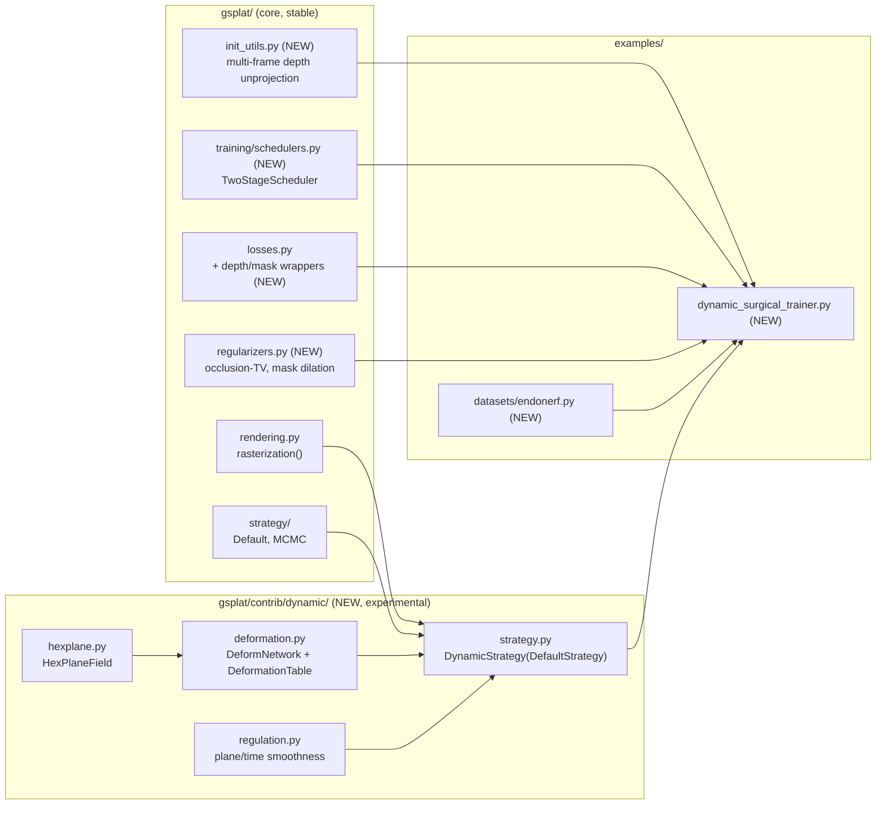

# G-SHARP v0.2 → gsplat Integration Plan

Branch: `vnath_gsharp` (off `nv/main`)
Source: `holohub/applications/surgical_scene_recon/`
Destination: `gsplat/`

## 1. Goals and non-goals

**Goals**
- Port all **training-time algorithmic** contributions of G-SHARP v0.2 natively into gsplat.
- Keep the deformable / 4D Gaussian machinery behind a clearly experimental `gsplat/contrib/` namespace.
- Ship test-first: every ported unit has positive + negative pytest cases.
- Provide a runnable end-to-end tutorial on the EndoNeRF sample.

**Non-goals**
- No Holoscan / HoloHub imports anywhere.
- No Depth Anything V2 / MedSAM3 / VGGT code inside the `gsplat/` package. These are external pretrained nets; the tutorial only *references* them as optional upstream preprocessing.
- No compression / rate-distortion work (not present in G-SHARP v0.2).
- No camera-pose optimization (G-SHARP v0.2 doesn't do it either).

## 2. Architecture

**Rationale**
- Core library stays pure splatting math. Depth losses / occlusion-TV / multi-frame init / two-stage schedule are generic and low-risk.
- 4D / deformable pieces are still research-grade → `gsplat/contrib/dynamic/` signals "ships with the wheel, API may change".
- EndoNeRF/SCARED loader is domain glue → lives with `colmap.py` / `ncore.py` under `examples/datasets/`.

## 3. Component → file map

### Core (stable)

| Component | New file | G-SHARP source |
|---|---|---|
| Binocular disparity L1 loss | `gsplat/losses.py` (added alongside existing depth losses) | `EndoRunner.compute_depth_loss`, `training/gsplat_train.py` 906–960 |
| Pearson depth loss (mono) | same | same |
| Masked L1 / SSIM wrappers | same | `training/gsplat_train.py` 1059–1101 |
| Occlusion-TV regularizer | `gsplat/regularizers.py` | `compute_tv_loss_targeted`, `training/gsplat_train.py` 1925–2028 |
| Torch mask dilation | same | OpenCV dilation replaced by max-pool |
| Invisible-mask builder | same | `create_invisible_mask_from_paths` |
| Multi-frame depth unprojection | `gsplat/init_utils.py` | `accumulate_multiframe_pointcloud`, `training/gsplat_train.py` 2036–2159 |
| KNN scale init | same | `create_splats_with_optimizers`, 1796–1906 |
| Two-stage scheduler | `gsplat/training/schedulers.py` | `EndoRunner._train_stage`, 1007–1050 |

### Contrib (experimental)

| Component | New file | G-SHARP source |
|---|---|---|
| HexPlane field | `gsplat/contrib/dynamic/hexplane.py` | `training/scene/hexplane.py` |
| Deform MLP + per-Gaussian deformation table | `gsplat/contrib/dynamic/deformation.py` | `training/scene/deformation.py`, `training/gsplat_train.py` 1376–1664 |
| Plane / time smoothness regularizers | `gsplat/contrib/dynamic/regulation.py` | `training/scene/regulation.py`, loop 1233–1272 |
| DynamicStrategy | `gsplat/contrib/dynamic/strategy.py` | `rasterize_splats`, 864–896 |

### Examples / docs

| Deliverable | Path |
|---|---|
| EndoNeRF/SCARED dataset loader | `gsplat/examples/datasets/endonerf.py` |
| Dynamic-scene trainer recipe | `gsplat/examples/dynamic_surgical_trainer.py` |
| Tutorial | `gsplat/docs/source/examples/dynamic_surgical.rst` |
| Contrib API docs | `gsplat/docs/source/apis/contrib.rst` |
| Full proposal inside repo | `gsplat/docs/source/proposals/gsharp_v0_2_port.rst` |

## 4. Test matrix (positive + negative)

Every new module gets a `tests/test_*.py` with both happy-path and failure cases. Tests follow the flat layout and pytest conventions already in `gsplat/tests/` (`conftest.py`, seed 42, CUDA-aware).

| Test file | Positive cases | Negative cases |
|---|---|---|
| `test_losses_depth.py` | identical depths → 0; gradient flows; mask slices correct; Pearson on correlated → 0, anti-correlated → 2 | shape mismatch raises; fully masked → 0 (no NaN); negative/zero depth handled via eps |
| `test_regularizers_occlusion.py` | TV on constant image = 0; step-edge = analytic; dilate(k=1) is identity | empty mask → 0 (no div-by-0); non-binary mask rejected |
| `test_init_multiframe.py` | synthetic cube recovered within 1e-5; RGB per point matches source | shape mismatch across frames raises; fully masked → empty set |
| `test_two_stage_scheduler.py` | coarse locks on frame 0; fine shuffles | negative step count raises |
| `test_contrib_hexplane.py` | forward shape; gradients reach plane params | out-of-bounds t handled per config |
| `test_contrib_deformnet.py` | zero-init → identity on means/quats/opacities; gradients flow | dtype/device mismatch raises |
| `test_contrib_dynamic_strategy.py` | `check_sanity` passes; densify resizes deformation table; 1-step train no NaN | missing `initialize_state` raises clear error |
| `test_dataset_endonerf.py` | tiny EndoNeRF fixture loads; SCARED routing works | missing `poses_bounds.npy` raises; non-binary mask rejected |

## 5. Execution order

See the todos pinned to the plan file. TDD per component: write failing test → implement → green.

## 6. What's already landed (scaffolding PR)

- Branch `vnath_gsharp` created off `nv/main`.
- All stub files created at their destination paths with docstrings + `NotImplementedError` placeholders so the directory tree review-ready.
- Empty pytest stubs marked `pytest.skip("vnath_gsharp: not yet implemented")` to keep CI green.
- Full proposal checked in at `gsplat/docs/source/proposals/gsharp_v0_2_port.rst`.
- Shareable HTML at `planning/gsharp_gsplat_plan.html`.

## 7. Open risks

- **Deformation + `rasterization()` coupling** — `gsplat.rasterization` has no time axis. Solution: `DynamicStrategy` applies deform-net to `(means, quats, opacities)` *before* `rasterization()` call (same pattern as G-SHARP's `rasterize_splats`).
- **CUDA-only tests** — HexPlane/DeformNet tests run on CPU; GPU smoke test marked CUDA-only.
- **EndoNeRF sample license** — documented in tutorial, not redistributed in-tree.
- **sklearn optional dep** — pure-torch fallback for KNN init keeps required deps unchanged.
